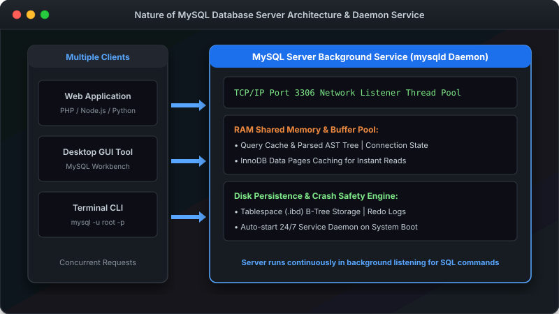
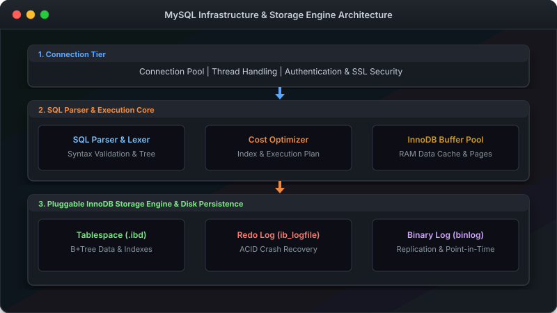
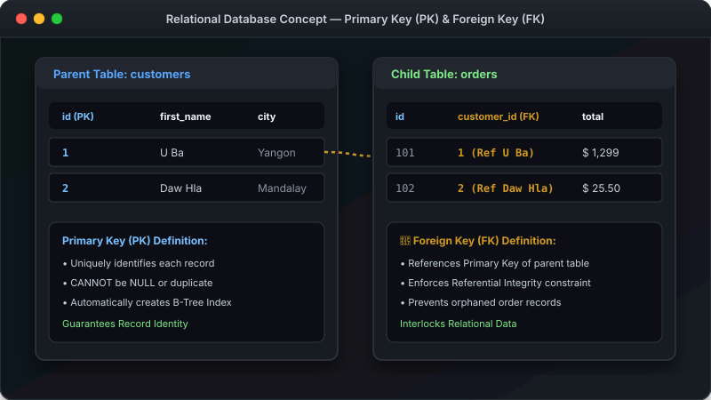
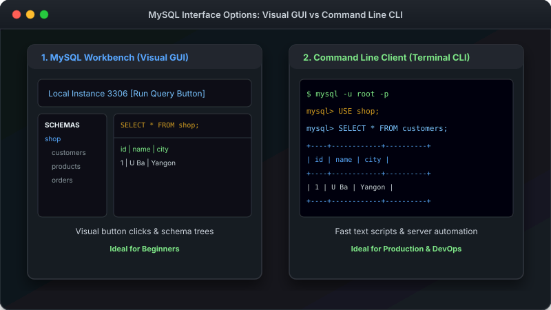

# သင်ခန်းစာ ၁ — MySQL အကြောင်း မိတ်ဆက် (Introduction to MySQL)

---

## 1. MySQL ဆိုသည်မှာ ဘာလဲ? (What Is MySQL?)

MySQL ဆိုသည်မှာ **Relational Database Management System (RDBMS / ဒေတာဘေ့စ် စီမံခန့်ခွဲသည့် ဆော့ဖ်ဝဲလ်)** တစ်ခုဖြစ်ပါသည်။ Data (အချက်အလက်) များကို စနစ်တကျ သေသေချာချာ သိမ်းဆည်းထားပြီး လိုအပ်သည့်အခါ မြန်မြန်ဆန်ဆန် ရှာဖွေခြင်း၊ အသစ်ထည့်ခြင်း၊ ပြင်ဆင်ခြင်းနှင့် ဖျက်ပစ်ခြင်းများကို ဆောင်ရွက်ပေးနိုင်ပါသည်။

---

## 2. MySQL Server ၏ သဘာဝနှင့် အလုပ်လုပ်ပုံ (Nature of MySQL Database Server)

MySQL သည် သာမန် Desktop Application တစ်ခုကဲ့သို့ မဟုတ်ဘဲ **Background Daemon Service (`mysqld`)** အဖြစ် အမြဲတမ်း နောက်ကွယ်တွင် Run နေသော Server တစ်ခုဖြစ်ပါသည်။

- **24/7 Background Service Daemon** — ကွန်ပျူတာ စတင်တက်သည်နှင့် မသိမသာ Background တွင် အမြဲ အဆင်သင့် စောင့်ဆိုင်းနေပါသည်။
- **Network Listener (Port 3306)** — TCP/IP Port 3306 တွင် Incoming Connection များကို စောင့်ဆိုင်းနားထောင်ပြီး Client များ၏ တောင်းဆိုချက်များကို လက်ခံပါသည်။
- **Multi-Threaded Concurrent Handling** — Web Server (PHP, Node.js), Mobile App API နှင့် Desktop GUI (Workbench) စသည့် Client များစွာ၏ တောင်းဆိုချက်များကို ပြိုင်တူ တုံ့ပြန်ဆောင်ရွက်ပေးပါသည်။
- **RAM Caching & Shared Memory** — ဖတ်ရှုမှု မြန်ဆန်စေရန်အတွက် အသုံးများသော ဒေတာများကို Buffer Pool (RAM) တွင် ယာယီ Cache သိမ်းဆည်းပေးပါသည်။
- **Disk Persistence & Crash Recovery** — ဒေတာများကို Solid State Drive (SSD) သို့မဟုတ် Hard Disk ပေါ်တွင် စနစ်တကျ Persistence သိမ်းဆည်းပေးပြီး၊ မီးပျက်ပါက Redo Log ဖြင့် ပြန်လည် တည်ဆောက်ပေးပါသည်။

---

## 3. Database Thinking: ဖိုင်စနစ်နှင့် Database စနစ် ယှဉ်ကြည့်ခြင်း

အပလီကေးရှင်း အသစ်တစ်ခု စတင်တည်ဆောက်သည့်အခါ "ဘာကြောင့် Excel သို့မဟုတ် Text File ကို မသုံးဘဲ Database ကို သုံးရသလဲ?" ဆိုသည့် အမေးမှာ အစပျိုးသူများအတွက် အလွန် အရေးပါသော Database Thinking ဖြစ်ပါသည်။

| အသွင်အပြင် (Feature) | သာမန် ဖိုင်စနစ် (Text / CSV / Excel) | Relational Database System (MySQL) |
|---|---|---|
| **Concurrent Access** | လူအများပြိုင်တူ ရေးပါက ဖိုင် ပျက်စီးနိုင်သည် (File Lock Issue) | ဧည့်သည် သောင်းပေါင်းများသည် ပြိုင်တူ သုံးစွဲနိုင်သည် (Row-Level Locking) |
| **Crash Recovery** | မီးပျက်ပါက ဒေတာများ ပျောက်ဆုံး/ပျက်စီးနိုင်သည် | InnoDB Redo Log ကြောင့် မီးပျက်သော်လည်း ဒေတာ မပျောက် (ACID Compliant) |
| **Data Integrity** | စာရိုက်မှားပါက မည်သူမျှ မတားဆီးနိုင် | Data Type & Constraint (NOT NULL, UNIQUE) ဖြင့် စစ်ဆေးပေးသည် |
| **Search Performance** | ဖိုင်အစမှ အဆုံးအထိ လိုက်ရှာရသည် (Full Scan) | B-Tree Index ဖြင့် စက္ကန့်ပိုင်းအတွင်း ရှာဖွေနိုင်သည် |

---

## 4. Database Structure: ဖိုင်တွဲဗီရို နှိုင်းယှဉ်ချက် မော်ဒယ်

Database ၏ သဘောတရားကို ရုံးသုံး ဖိုင်တွဲဗီရို (Filing Cabinet) နှင့် နှိုင်းယှဉ်ကြည့်ပါက အလွန်လွယ်ကူသည် နားလည်နိုင်ပါသည်။

### အသုံးအနှုန်းများ နှိုင်းယှဉ်ချက် ဇယား

| Term (အသုံးအနှုန်း) | ပြင်ပကမ္ဘာနှင့် နှိုင်းယှဉ်ချက် | MySQL တွင် ခေါ်ဆိုပုံ |
|---|---|---|
| **Database** | ဖိုင်တွဲ ဗီရိုတစ်ခုလုံး | နှီးနွှယ်နေသော Table များ စုစည်းရာ (`shop`) |
| **Table** | ဗီရိုထဲမှ အံဆွဲတစ်ဆွဲ | အချက်အလက်များ စနစ်တကျ ထည့်ထားသော ဇယား (`customers`, `products`) |
| **Row (Record)** | အံဆွဲထဲမှ ဖိုင်ရွက်တစ်ရွက် | ဒေတာတစ်ကြောင်း (ဝယ်သူတစ်ယောက် သို့ ကုန်ပစ္စည်းတစ်ခု၏ ဒေတာ) |
| **Column (Field)** | ဖိုင်ရွက်ပေါ်မှ စာကြောင်းခေါင်းစဉ် | ဒေတာ အမျိုးအစား တစ်ခု (`name`, `price`, `email`) |

---

## 5. MySQL Server Infrastructure & Internal Architecture

MySQL Server ၏ အနောက်ကွယ် အခြေခံအဆောက်အအုံ (Infrastructure) တွင် အဓိက အလွှာ (၃) လွှာ ဖွဲ့စည်းထားပါသည်:

1. **Connection Tier (ချိတ်ဆက်မှု အလွှာ)** — Client များမှ စာပို့လာသော Connection များကို လက်ခံခြင်း၊ Password/SSL စစ်ဆေးခြင်းနှင့် Thread Pool ဖြင့် စီမံပေးခြင်း။
2. **SQL Parser & Optimizer Core (ဆာဗာ ဗဟိုအလွှာ)** — စာရိုက်လိုက်သော SQL Syntax များကို စစ်ဆေးခြင်း၊ ရလဒ် အမြန်ဆုံး ရရှိစေရန် Cost Optimizer ဖြင့် Query Plan ရွေးချယ်ခြင်းနှင့် RAM တွင် Buffer Pool Caching ပြုလုပ်ပေးခြင်း။
3. **Pluggable Storage Engine (InnoDB Data Persistence Layer)** — ဒေတာများကို Hard Disk / SSD ပေါ်တွင် `.ibd` Tablespace ဖိုင်အဖြစ် persistent ဖြစ်အောင် ရေးသားခြင်းနှင့် Redo Log (Crash Recovery) ဖြင့် ဒေတာ လုံခြုံရေး တည်ဆောက်ပေးခြင်း။

---

## 6. Relational Data Model: Primary Key & Foreign Key Interlocking

Relational Database တစ်ခု၏ အဓိက စွမ်းအားမှာ Table များအကြား **Primary Key (PK)** နှင့် **Foreign Key (FK)** တို့ကို အသုံးပြု၍ စနစ်တကျ ချိတ်ဆက်ထားခြင်း ဖြစ်ပါသည်။

- **Primary Key (PK)** — Table တစ်ခုအတွင်းရှိ Record တစ်ကြောင်းချင်းစီကို ထူးခြားသည် မှတ်ပုံတင်ပေးသော ID ဖြစ်ပါသည်။ (မထပ်ရပါ၊ NULL မဖြစ်ရပါ)။
- **Foreign Key (FK)** — မိခင် Table ၏ Primary Key ကို ညွှန်ပြရန် သုံးသော Key ဖြစ်ပြီး၊ အဓိပ္ပာယ်မရှိသော ဒေတာကျန်ခဲ့ခြင်းမှ ကာကွယ်ပေးပါသည်။ (Referential Integrity)။

---

## 7. SQL Query Execution Lifecycle (Query ၏ ခရီးစဉ်)

သင်သည် Terminal သို့မဟုတ် Workbench တွင် `SELECT * FROM users WHERE id=5;` ဟု ရိုက်နှိပ်လိုက်သောအခါ ဆာဗာအတွင်း အောက်ပါအတိုင်း အဆင့်ဆင့် အလုပ်လုပ်သွားပါသည်:

1. **SQL Text Input** — Client App မှ SQL စာသားကို TCP/IP Port 3306 မှတစ်ဆင့် MySQL သို့ ပို့လိုက်ပါသည်။
2. **Parser & Lexer** — MySQL မှ စာလုံးပေါင်းနှင့် Syntax မှန်မမှန် စစ်ဆေးကာ Abstract Syntax Tree (AST) တည်ဆောက်ပါသည်။
3. **Cost Optimizer** — အမြန်ဆုံး Query Execution Plan များကို တွက်ချက်ကာ Index အသုံးပြုမည့် လမ်းကြောင်းကို ရွေးချယ်ပါသည်။
4. **Storage Engine Read** — InnoDB Engine မှ RAM Buffer Pool သို့မဟုတ် Disk ထဲရှိ Data Page မှ ရလဒ်ကို ဖတ်ယူပါသည်။
5. **Result Set Return** — ရှာဖွေတွေ့ရှိသော Row ဒေတာများကို Client သို့ ပြန်လည် ပေးပို့ပြသပါသည်။

---

## 8. MySQL ကို အသုံးပြုနိုင်သော နည်းလမ်း (၂) မျိုး

MySQL ကို မိမိ နှစ်သက်ရာ နည်းလမ်းဖြင့် ချိတ်ဆက် သုံးစွဲနိုင်ပါသည်။

1. **MySQL Workbench** — ခလုတ်များ၊ Menu များပါဝင်သော Visual စနစ်ဖြစ်ပြီး အစပျိုးသူများအတွက် လွယ်ကူပါသည်။
2. **Command Line (Terminal)** — စာရိုက်ပြီး တိုက်ရိုက် ခိုင်းစေသည့် စနစ်ဖြစ်ပြီး ကျွမ်းကျင်သူများ သုံးစွဲကြပါသည်။

ဤသင်ခန်းစာစာအုပ်တွင် **နည်းလမ်း နှစ်ခုလုံး** ကို သင်ကြားပေးသွားပါမည်။

---

## 9. နောက်ထပ် သွားရမည့် အဆင့်

MySQL ၏ သဘာဝနှင့် Infrastructure Architecture ကို နားလည်သွားပြီဖြစ်၍ မိမိ ကွန်ပျူတာပေါ်တွင် MySQL Server စတင် install ပြုလုပ်ကြပါစို့။

-> [သင်ခန်းစာ ၂: MySQL Server တပ်ဆင်နည်း](02-installation.md)
