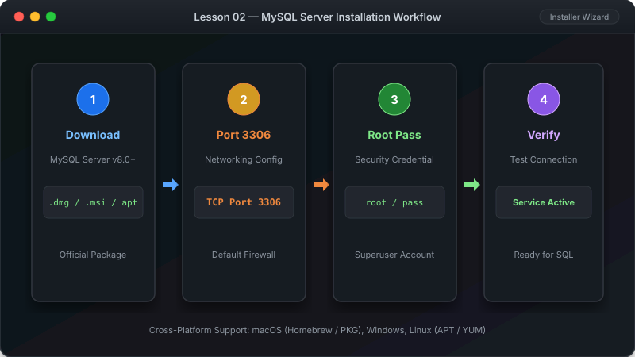

# သင်ခန်းစာ ၂ — MySQL တပ်ဆင်ခြင်း (Installation Guide)



မိမိ ကွန်ပျူတာပေါ်မာ MySQL Server နှင့် Workbench တို့ကို ဘေးကင်းစွာ တပ်ဆင်နည်း အဆင့်ဆင့်ဖြစ်ပါတယ်။
ဤသင်ခန်းစာမာ မိမိ ကွန်ပျူတာပေါ်မာ MySQL Server ကို စနစ်တကျ Install ပြုလုပ်သွားပါမည်။ မိမိ အသုံးပြုသော Operating System အလိုက် အောက်ပါ နည်းလမ်းများမှ ရွေးချယ် တပ်ဆင်ပါ။

**ခန့်မှန်း ကြာချိန် - မိနစ် ၃၀**

---

##  MySQL Architecture & Installation Flow (တပ်ဆင်မှု လမ်းကြောင်း ပုံရိပ်)

```

                      MySQL System Architecture                          

                                    
                                    
       
                         MySQL Server Engine                     
                          (Background Service)                   
                           Port: 3306 (Default)                  
       
                                    
            
                                                           
               
 Client Tool 1: Workbench GUI                  Client Tool 2: mysql CLI
 (Visual Click & Manage)                       (Terminal Command Line) 
               
```

---

##  Install မလုပ်မီ အွန်လိုင်းမာ စမ်းသပ်ကြည့်ချင်ပါသလား?

Install လုံးဝ မလုပ်မီ SQL query ရေးသားပုံကို အွန်လိုင်းမာ အလျင်စမ်းသပ်ချင်ပါက အောက်ပါ Free Tool များကို အသုံးပြုနိုင်ပါတယ် -

| Website | ပြုလုပ်နိုင်သော လုပ်ဆောင်ချက် |
|---|---|
| [SQLFiddle](http://sqlfiddle.com/) | Browser ပေါ်တွင်တင် SQL ရေးသားပြီးလျှင် စမ်းသပ်နိုင်သည် |
| [DB Fiddle](https://www.db-fiddle.com/) | Table များ ဖန်တီးပြီးလျှင် Query များ Run နိုင်သည် |
| [MySQL Sandbox](https://mysqlsandbox.net/) | အခမဲ့ အွန်လိုင်း MySQL ပတ်ဝန်းကျင် |

---

##  နည်းလမ်း (A): Windows ပေါ်မာ Install လုပ်နည်း

```
[ Download Installer ]  [ Run Setup (Developer Default) ]  [ Set Root Password ]  [ Finish & Verify ]
```

### အဆင့် ၁ - MySQL Installer ဤါင်းလုဒ်ဆွဲပါ

1. Web browser မှတစ်ဆင့် https://dev.mysql.com/downloads/installer/ သို့ သွားပါ။
2. **"MySQL Installer for Windows"** (`mysql-installer-web-community.exe`) ၏ **"Download"** ခလုတ်ကို နှိပ်ပါ။
3. Login ဝင်ခိုင်းပါက အောက်နားတွင်ရှိသော **"No thanks, just start my download."** ကို နှိပ်ပါ။

### အဆင့် ၂ - Installer ကို Run ပါ

1. ဤါင်းလုဒ်ရလာသော `mysql-installer-web-community.exe` ကို Double-click နှိပ်ပါ။
2. Setup Type မာ **"Developer Default"** ကို ရွေးချယ်ပါ။
3. **Next** ကို နှိပ်ပါ။ လိုအပ်သော ဖိုင်များကို ဤါင်းလုဒ်ဆွဲပါလိမ့်မည်။

### အဆင့် ၃ - Root Password သတ်မှတ်ပါ

1. Password တောင်းသည့် အဆင့်သို့ ရောက်ပါက root user အတွက် **လုံခြုံမှုရှိသော Password** တစ်ခု သတ်မှတ်ပါ။
2. **အရေးကြီးဂရုစိုက်ပါ:** ဤ Password ကို မမေ့အောင် မှတ်ထားပါ။ နောက်ပိုင်း ချိတ်ဆက်သည့်အခါတိုင်း လိုအပ်ပါမည်။
3. ကျန်ရှိသော အဆင့်များကို Default အတိုင်း **Next** ဆက်နှိပ်သွားပါ။

### အဆင့် ၄ - တပ်ဆင်မှုကို ပြီးဆုံးအောင် လုပ်ပါ

1. **Execute** ခလုတ်ကို နှိပ်ပြီးလျှင် ပြောင်းလဲမှုများကို စတင်ပါ။
2. အဆင့်တိုင်းမာ အစိမ်းရောင် အမှတ်အသား () ပေါ်လာသည်အထိ စောင့်ပါ။
3. **Finish** ကို နှိပ်ပါ။

### အဆင့် ၅ - Install အောင်မြင်ကြောင်း စစ်ဆေးပါ

1. Windows Search မာ "cmd" ဟု ရိုက်ရှာပြီးလျှင် **Command Prompt** ကို ဖွင့်ပါ။
2. အောက်ပါ command ကို ရိုက်ထည့်ပြီးလျှင် Enter နှိပ်ပါ -

```cmd
mysql --version
```

3. `mysql Ver 8.0.xxx` ကဲ့သို့ Version နံပါတ် ပေါ်လာပါက MySQL တပ်ဆင်မှု အောင်မြင်ပါသည်။

---

##  နည်းလမ်း (B): Mac ပေါ်မာ Install လုပ်နည်း (Homebrew သုံးပြီးလျှင်)

### အဆင့် ၁ - Homebrew တပ်ဆင်ပါ (မဟိသေးပါက)

**Terminal** ကို ဖွင့်ပြီးလျှင် အောက်ပါ command ကို Paste လုပ်ပြီးလျှင် Run ပါ -

```bash
/bin/bash -c "$(curl -fsSL https://raw.githubusercontent.com/Homebrew/install/HEAD/install.sh)"
```

### အဆင့် ၂ - MySQL ကို Install လုပ်ပါ

Terminal မာ အောက်ပါအတိုင်း ရိုက်ထည့်ပါ -

```bash
brew install mysql
```

### အဆင့် ၃ - MySQL Service ကို စတင်ပါ (Start)

```bash
brew services start mysql
```

### အဆင့် ၄ - လုံခြုံရေး ပြင်ဆင်ချက်များ သတ်မှတ်ပါ

```bash
mysql_secure_installation
```

မေးခွန်းများ မေးလာပါက Root Password သတ်မှတ်ပေးပြီးလျှင် ကျန်မေးခွန်းများကို **Y** ဟု ဖြေကြားပါ။

### အဆင့် ၅ - စစ်ဆေးပါ

```bash
mysql --version
```

---

##  နည်းလမ်း (C): Linux (Ubuntu/Debian) ပေါ်မာ Install လုပ်နည်း

```

 1. sudo apt update                                          
 2. sudo apt install mysql-server                            
 3. sudo systemctl start mysql                               
 4. sudo mysql_secure_installation                           

```

### အဆင့် ၁ - Package List ကို Update လုပ်ပါ

Terminal ဖွင့်ပြီးလျှင် ရိုက်ထည့်ပါ -

```bash
sudo apt update
```

### အဆင့် ၂ - MySQL Server တပ်ဆင်ပါ

```bash
sudo apt install mysql-server
```

အတည်ပြုခိုင်းပါက `Y` ကို နှိပ်ပါ။

### အဆင့် ၃ - MySQL Service ကို Start လုပ်ပါ

```bash
sudo systemctl start mysql
sudo systemctl enable mysql
```

### အဆင့် ၄ - လုံခြုံရေး သတ်မှတ်ချက်များ ပြုလုပ်ပါ

```bash
sudo mysql_secure_installation
```

Root password သတ်မှတ်ပြီးလျှင် မေးခွန်းများကို `Y` ဖြင့် အတည်ပြုပါ။

### အဆင့် ၅ - စစ်ဆေးပါ

```bash
mysql --version
```

---

##  နည်းလမ်း (D): Docker ဖြင့် Install လုပ်နည်း (OS အားလုံးအတွက်)

Docker ရှိထားပါက အောက်ပါ Command တစ်ကြောင်းတည်းဖြင့် MySQL Server ကို ရရှိနိုင်ပါတယ် -

```bash
docker run --name mysql-beginner -e MYSQL_ROOT_PASSWORD=mysecret123 -p 3306:3306 -d mysql:8
```

- `--name mysql-beginner` — Container ၏ အမည်
- `-e MYSQL_ROOT_PASSWORD=mysecret123` — Root Password (မိမိ နှစ်သက်ရာ ပြောင်းနိုင်သည်)
- `-p 3306:3306` — Computer Port နှင့် Container Port ကို ချိတ်ဆက်ခြင်း
- `-d` — Background မာ Run ခိုင်းခြင်း

- ရပ်တန့်လိုပါက - `docker stop mysql-beginner`
- ပြန်စလိုပါက - `docker start mysql-beginner`

---

##  တွေ့ကြုံရတတ်သော ပြဿနာနှင့် ဖြေရှင်းနည်းများ (Troubleshooting)

```
  
   Common Installation Issue Resolver                                   
  
   "mysql: command not found"         System PATH မာ မပါသေးပါ။            
                                      Reinstall သို့မဟုတ် PATH ထည့်ပါ။  
  
   "Access denied for user 'root'"    Password မှားရိုက်မိခြင်းဖြစ်ပါသည်။
                                      Caps Lock ဖွင့်ထားမိလား စစ်ပါ။    
  
   Port 3306 already in use           အခြား Service တစ်ခုမှ သုံးနေခြင်း။ 
                                      Port ပြောင်းပါ သို့ ထို App ကို ပိတ်ပါ။
  
```

---

##  Root Password ဆိုသည်မှာ ဘာလဲ?

**Root Password** ဆိုသည်မှာ သင်၏ Database အတွက် **ပင်မ သော့ချက် (Master Key)** ဖြစ်ပါတယ်။ MySQL သို့ ချိတ်ဆက်သည့် အခါတိုင်း ဤ Password လိုအပ်ပါမည်။ **မေ့မသွားအောင် သေသေချာချာ မှတ်ထားပါ။**

---

##  နောက်ထပ် သွားရမည့် အဆင့်

MySQL Server ကို အောင်မြင်စွာ Install လုပ်ပြီးပြီဖြစ်လို့ Graphical UI ဖြင့် လွယ်ကူစွာ အသုံးပြုနိုင်သော **MySQL Workbench** အသုံးပြုပုံကို လေ့လာကြပါစို့။

-> [သင်ခန်းစာ ၃: MySQL Workbench အသုံးပြုနည်း Guide](03-workbench.md)
