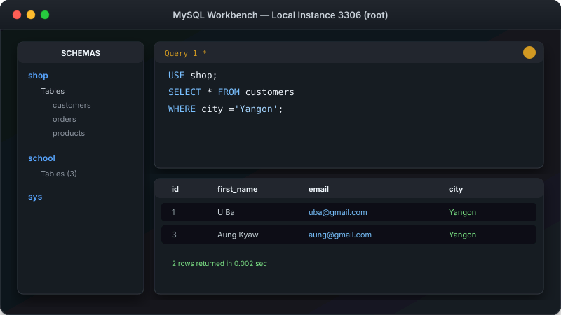

# သင်ခန်းစာ ၃ — MySQL Workbench GUI အသုံးပြုနည်း



MySQL Workbench သည် Graphical User Interface (GUI) Tool ဖြစ်ပြီးလျှင် မောက်စ် (Mouse) ဖြင့် နှိပ်ပြီးလျှင် Database များကို လွယ်ကူသည် ကိုင်တွယ်နိုင်အောင် ကူညီပေးပါသည် -
ဝဲလ် ဖြစ်ပါတယ်။ **အစပျိုးသူများအတွက် အကောင်းဆုံး Tool ဖြစ်ပါတယ်**။

**ခန့်မှန်း ကြာချိန် - မိနစ် ၃၀**

---

##  MySQL Workbench GUI Layout Illustration (မျက်ပြင် ပြင်ဆင်ပုံ ပုံရိပ်)


---

##  အဆင့် ၁ - MySQL Workbench ကို ဖွင့်ပါ

- **Windows ပေါ်မာ:** Start Menu တွင် "MySQL Workbench" ဟု ရိုက်ရှာပြီးလျှင် ဖွင့်ပါ။
- **Mac ပေါ်မာ:** Finder  Applications  MySQL Workbench ကို ဖွင့်ပါ။
- **Linux ပေါ်မာ:** Application Menu တွင် "MySQL Workbench" ကို ရှာပြီးလျှင် ဖွင့်ပါ။

---

##  အဆင့် ၂ - MySQL Server နှင့် ချိတ်ဆက်မှု (Connection) ပြုလုပ်ပါ

Workbench စတင်ပွင့်လာချိန်တွင် **"MySQL Connections"** ခေါင်းစဉ်ကို တွေ့ရပါမည်။


1. **"MySQL Connections"** ဘေးတွင်ရှိသော **"+"** လက္ခဏာကို နှိပ်ပါ။
2. အောက်ပါ အချက်အလက်များကို ဖြည့်သွင်းပါ -

| Setting (သတ်မှတ်ချက်) | ဖြည့်သွင်းရမည့် အချက် |
|---|---|
| **Connection Name** | `Local MySQL` (သို့ မိမိ ကြိုက်နှစ်သက်ရာ အမည်) |
| **Hostname** | `localhost` (မိမိ ကွန်ပျူတာကို ညွှန်းပါသည်) |
| **Port** | `3306` (Default Port ဖြစ်သည်) |
| **Username** | `root` |
| **Password** | MySQL Install စဉ်က ပေးခဲ့သော Root Password |

3. **"Test Connection"** ကို နှိပ်ပါ။ "Connection succeeded" ဟု ပေါ်လာပါက အဆင်ပြေပါပြီ။
4. **"OK"** နှိပ်ပြီးလျှင် သိမ်းဆည်းပါ။

---

##  အဆင့် ၃ - Server ထို့ ဝင်ရောက်ပါ

1. ပင်မမျက်နှာပြင်တွင် ပေါ်နေသော Connection သေတ္တာလေးကို Double-click နှိပ်ပါ။
2. Root Password တောင်းပါက ရိုက်ထည့်ပါ။
3. Workbench Dashboard သို့ ရောက်ရှိသွားပါပြီ။

---

##  အဆင့် ၄ - Workbench ၏ အဓိက ဧရိယာ (၄) ခု

| ဧရိယာ | လုပ်ဆောင်ချက် |
|---|---|
| **Schema Panel** (လက်ဝဲဘက်) | Database များကို ဖိုင်တွဲများပိုင် ပြသပေးသော နေရာ |
| **SQL Editor** (အလယ်) | SQL Query များကို စာရိုက် ရေးသားသည့် နေရာ |
| **Query Output** (အောက်/လက်ညာ) | ရေးသားလိုက်သော Query ၏ ရလဒ် ဇယား ပေါ်လာသည့် နေရာ |
| **Toolbar** (ထိပ်ပိုင်း) | Query Run ရန် လျှပ်စီးကြောင်းပုံ () ခလုတ်နှင့် အခြား ခလုတ်များ |

---

##  အဆင့် ၅ - ပထမဆုံး Query ကို Run ကြည့်ပါ

1. SQL Editor တွင် အောက်ပါအတိုင်း ရိုက်ထည့်ပါ -

```sql
SHOW DATABASES;
```

2. ထိပ်ပိုင်း Toolbar ရှိ **လျှပ်စီးကြောင်းပုံ ()** ခလုတ်ကို နှိပ်ပါ (သို့မဟုတ် Keyboard မှ `Ctrl + Enter` နှိပ်ပါ)။
3. အောက်ဘက် Output Panel တွင် Database စာရင်းများ ပေါ်လာသည်ကို တွေ့ရပါမည် -
   - `information_schema`
   - `mysql`
   - `performance_schema`
   - `sys`

---

##  အဆင့် ၆ - ကိုယ်ပိုင် Database တစ်ခု ဖန်တီးခြင်း

SQL Editor တွင် အောက်ပါအတိုင်း ရိုက်ထည့်ပြီးလျှင် Run ပါ -

```sql
CREATE DATABASE my_first_db;
```

`Ctrl + Enter` နှိပ်ပြီးလျှင် Run ပြီးပါက လက်ဝဲဘက် **Schema Panel** တွင် Right-click ထိပြီးလျှင် **"Refresh All"** ကို နှိပ်ပါ။ `my_first_db` ပေါ်လာသည်ကို တွေ့ရပါမည်။

---

##  အဆင့် ၇ - Table ထဲဟိ Data များကို Visual ဖြင့် ကြည့်ရှုခြင်း

SQL ရေးရန် မလိုဘဲ visual အတိုင်း ကြည့်လိုပါက -

1. Schema Panel ရှိ Database အမည်ဘေးမှ မျှားလေးကို နှိပ်ပြီးလျှင် ချဲ့ပါ။
2. **Tables** အပိုင်းအောက်ဟိ Table တစ်ခု၏ ဘေးတွင်ပေါ်နေသော **ဇယားကွက်ပုံ (Table Icon)** ကို နှိပ်ပါ။
3. Excel Spreadsheet ပိုင် Data များကို တိုက်ရိုက် ကြည့်ရှု/ပြင်ဆင်နိုင်ပါသည်။

---

##  အသုံးဝင်သော Keyboard Shortcuts များ

| Shortcut Key | လုပ်ဆောင်ချက် (Action) |
|---|---|
| `Ctrl + Enter` (Windows/Linux) / `Cmd + Enter` (Mac) | လက်ရှိ SQL Query ကို Run ရန် |
| `Ctrl + Shift + Enter` | SQL Script တစ်ခုလုံးကို အစမှ အဆုံး Run ရန် |
| `Ctrl + T` | SQL Query Tab အသစ် ဖွင့်ရန် |
| `Ctrl + S` | SQL Query Script ဖိုင်ကို သိမ်းဆည်းရန် |

---

##  လေ့ကျင့်ခန်း (Exercise)

Workbench တွင် အောက်ပါတို့ကို စမ်းသပ်ကြည့်ပါ -

1. `school_db` အမည်ဖြင့် Database တစ်ခု ဖန်တီးပါ။
2. `SHOW DATABASES;` ကို Run ပြီးလျှင် စစ်ဆေးပါ။
3. Workbench ကို ပိတ်ပြီးလျှင် ပြန်ဖွင့်ကြည့်ပါ။

---

##  နောက်ထပ် သွားရမည့် အဆင့်

Workbench ဖြင့် Visual သုံးတတ်ပြီဖြစ်လို့ ကျွမ်းကျင်သူများ နှစ်သက်ကြသော **Command Line (Terminal)** ဖြင့် MySQL အသုံးပြုနည်းကို ဆက်လက် လေ့လာကြပါစို့။

-> [သင်ခန်းစာ ၄: Command Line Basics](04-command-line.md)
