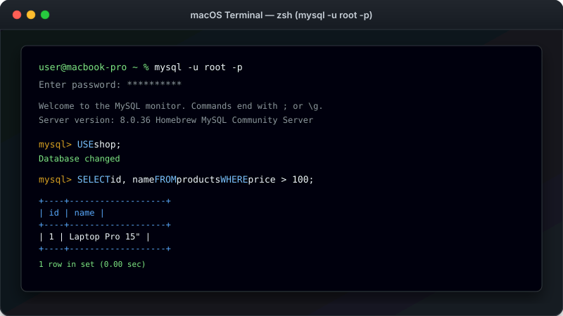

# သင်ခန်းစာ ၄ — Command Line (Terminal) အသုံးပြုနည်း



Command Line Client သို့မဟုတ် Terminal မှတစ်ဆင့် MySQL Server သို့ တိုက်ရိုက် စာရိုက် ရေးသားပြီးလျှင် ချိတ်ဆက် အသုံးပြုနည်း ဖြစ်ပါသည်။ Command Line (Terminal သို့ Console ဟုလည်း ခေါ်သည်) ဆိုသည်မှာ SQL Command များကို စာရိုက်ပြီးလျှင် တိုက်ရိုက် ခိုင်းစေသည့် နေရာဖြစ်ပါတယ်။ Developer များစွာစွာ လျင်မြန်ပြီးလျှင် စွမ်းအားထက်မြက်သည့်အတွက် ဤနည်းလမ်းကို ပိုမို ကြိုက်နှစ်သက်ကြပါတယ်။

---

##  Command Line အလုပ်လုပ်ပုံ မျက်မြင် visual ပုံရိပ်


**ခန့်မှန်း ကြာချိန် - မိနစ် ၃၀**

---

##  Command Line ဆိုသည်မှာ ဘာလဲ?

Command Line ဆိုသည်မှာ မျက်ပြင် ခလုတ်များကို နှိပ်စရာ မလိုဘဲ စာသား Command များ ရိုက်ထည့်ပြီးလျှင် MySQL နှင့် တိုက်ရိုက် စကားပြောသည့် စနစ်ဖြစ်ပါတယ်။

| Tool | အသုံးပြုပုံ | အသင့်တော်ဆုံး နေရာ |
|---|---|---|
| **Workbench** | ခလုတ်များ၊ Menu များကို နှိပ်သည် | အစပျိုးသူများနှင့် မျက်ပြင် ကြည့်ရှုလိုသူများ |
| **Command Line** | စာရိုက်ပြီးလျှင် Command ပေးသည် | မြန်ဆန်မှု၊ Auto စနစ်များနှင့် Server အသုံးပြုသူများ |

---

##  အဆင့် ၁ - Terminal ကို ဖွင့်ပါ

- **Windows မာ:** `Windows Key + R` ကို နှိပ်ပြီးလျှင် `cmd` ဟု ရိုက်ထည့်ပြီးလျှင် Enter နှိပ်ပါ။
- **Mac မာ:** `Cmd + Space` နှိပ်ပြီးလျှင် "Terminal" ဟု ရိုက်ရှာပါ။
- **Linux မာ:** `Ctrl + Alt + T` ကို နှိပ်ပါ။

မီးလင်းနိသော Cursor လေး ပါသည့် Terminal စာမျက်နှာ ပေါ်လာပါမည် -

```bash
C:\Users\yourname>       (Windows)
user@computer:~$          (Mac/Linux)
```

---

##  အဆင့် ၂ - MySQL ထို့ ချိတ်ဆက်ပါ (Connect)

Terminal မာ အောက်ပါ command ကို ရိုက်ထည့်ပြီးလျှင် Enter နှိပ်ပါ -

```bash
mysql -u root -p
```

###  Command တစ်ခုချင်းစီ၏ အဓိပ္ပာယ် -

- `mysql` — MySQL Program ကို ဖွင့်ရန် ခိုင်းခြင်း
- `-u root` — "root" user (အုပ်ချုပ်သူ အကောင့်) ဖြင့် Log in ဝင်ခြင်း
- `-p` — Password တောင်းဆိုခိုင်းခြင်း


`Enter password:` ဟု ပေါ်လာပါက Root Password ကို ရိုက်ထည့်ပါ (Password ရိုက်နေချိန် စာလုံးများ ပေါ်မည်မဟုတ်ပါ၊ စိတ်မပူပါနှင့်)။

အတည်ပြုပြီးပါက `mysql>` ဟု ပေါ်လာပါမည်။ ယင်းသည် MySQL ထဲသို့ အောင်မြင်စွာ ရောက်ရှိသွားပြီဖြစ်ပါတယ်။

---

##  အဆင့် ၃ - ပထမဆုံး Command ကို စမ်းသပ်ပါ

`mysql>` Prompt မာ အောက်ပါအတိုင်း ရိုက်ထည့်ပြီးလျှင် Enter နှိပ်ပါ -

```sql
SELECT 'Hello, MySQL!';
```

အောက်ပါအတိုင်း ရလဒ် ထွက်လာပါမည် -

```sql
+------------------+
| Hello, MySQL!    |
+------------------+
| Hello, MySQL!    |
+------------------+
1 row in set (0.00 sec)
```

---

##  အဆင့် ၄ - အသုံးဝင်သော command များ

### Database စာရင်း ကြည့်ရန် -
```sql
SHOW DATABASES;
```

### လက်ရှိ အသုံးပြုနေသော Database ကို ကြည့်ရန် -
```sql
SELECT DATABASE();
```

### Table ၏ အဆောက်အအုံကို စစ်ဆေးရန် -
```sql
DESCRIBE table_name;
```

### MySQL ထွက်ရန် -
```sql
EXIT;
```
*(သို့မဟုတ် `QUIT;` ဟုလည်း ရိုက်နိုင်ပါသည်)*

---

##  အရေးကြီးသော စည်းမျဉ်း - Semicolon (;) ပါရမည်

SQL Command တိုင်း၏ အဆုံးမာ Semicolon (`;`) မဖြစ်မနေ ပါရပါမည်။


```sql
SELECT * FROM users;   -- မှန်ကန်သည် 
SELECT * FROM users    -- မှားယွင်းသည်  (Semicolon မပါပါ)
```

---

##  Multi-Line Query ရေးသားပုံ Illustration

SQL Command များကို စာကြောင်း တစ်ကြောင်းမက ခွဲပြီးလျှင် ရေးသားနိုင်ပါတယ်။ Semicolon ရိုက်မချင်း MySQL မှ ဆက်လက် စောင့်ဆိုင်းပေးထားပါမည် -

```sql
SELECT first_name,
       last_name,
       email
FROM users;
```

---

##  SQL Script File ကို Command Line မှ Run နည်း

`.sql` ဖိုင်ထဲဟိ Command များကို တိုက်ရိုက် Run လိုပါက -

```bash
mysql -u root -p shop < /path/to/script.sql
```

သို့မဟုတ် MySQL ထဲရောက်မှ Run လိုပါက -

```sql
SOURCE /path/to/script.sql;
```

---

##  Command Line သုံးစွဲသူများအတွက် အသုံးဝင်သော Tips

- **Up Arrow (^)** — ယခင် ရိုက်ခဲ့သော Command များကို ပြန်ခေါ်ရန်
- **Tab Key** — Table သို့မဟုတ် Column အမည်များကို Auto စာလုံး ဖြည့်ရန်
- **Screen ရှင်းရန်:**
  - Mac/Linux မာ: `system clear`
  - Windows မာ: `system cls`

---

##  လေ့ကျင့်ခန်း (Exercise)

1. Terminal ကို ဖွင့်ပါ။
2. MySQL သို့ ချိတ်ဆက်ပါ (`mysql -u root -p`)
3. `SHOW DATABASES;` ကို Run ပါ။
4. `SELECT VERSION();` ဖြင့် MySQL Version ကို ကြည့်ပါ။
5. `EXIT;` ဖြင့် ပြန်ထွက်ပါ။

---

##  နောက်ထပ် သွားရမည့် အဆင့်

ယခုဆိုရင် Workbench နှင့် Command Line နှစ်ခုလုံး သုံးတတ်သွားပြီဖြစ်လို့ အချက်အလက်များပါဝင်သော Sample Database ထည့်သွင်းပြီးလျှင် ပထမဆုံး Query များကို စတင် ရေးသားကြပါစို့။

-> [သင်ခန်းစာ ၅: ပထမဆုံး Query များ ရေးသားခြင်း](05-first-queries.md)
