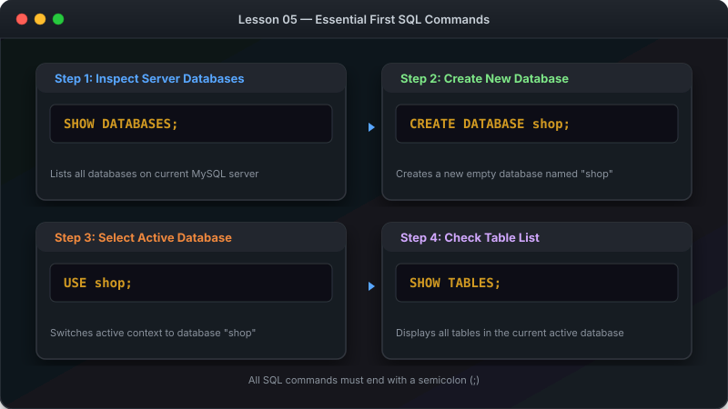

# သင်ခန်းစာ ၅ — ပထမဆုံး Query များကို ရေးသားခြင်း



ဤသင်ခန်းစာမာ မူလ Sample Database ကို အသုံးပြုပြီးလျှင် ပထမဆုံး SQL Query များ ရေးသားပြီးလျှင် Data ထုတ်ယူနည်းကို လေ့လာသွားပါမည်။

**ခန့်မှန်း ကြာချိန် - မိနစ် ၂၀**

---

##  အဆင့် ၁ - စမ်းသပ် Database ကို ထည့်သွင်းခြင်း

### Command Line မှ ထည့်သွင်းနည်း:

```bash
mysql -u root -p < sample-database.sql
```

သို့မဟုတ် MySQL ထဲမာ ရောက်ရှိနေပါက -

```sql
SOURCE /path/to/sample-database.sql;
```

### Workbench မှ ထည့်သွင်းနည်း:

1. Workbench ကို ဖွင့်ပြီးလျှင် Server နှင့် ချိတ်ဆက်ပါ။
2. **File  Open SQL Script** မှတစ်ဆင့် `sample-database.sql` ကို ရွေးချယ်ပါ။
3. **လျှပ်စီးကြောင်းပုံ ()** ခလုတ်ကို နှိပ်ပြီးလျှင် Run ပါ။

---

##  အဆင့် ၂ - အသုံးပြုမည့် Database ကို ရွေးချယ်ခြင်း

```sql
USE shop;
```

`Database changed` ဟု ပေါ်လာပါမည်။ ယခုအခါ ပြုလုပ်သမျှ Command အားလုံးစွာ `shop` Database ပေါ်မာ သက်ရောက်ပါမည်။

---

##  အဆင့် ၃ - ရှိနေသော Table စာရင်းများကို ကြည့်ရှုခြင်း

```sql
SHOW TABLES;
```

ရလဒ် ပေါ်လာပါမည် -

```sql
+----------------+
| Tables_in_shop |
+----------------+
| customers      |
| order_items    |
| orders         |
| products       |
+----------------+
```

---

##  အဆင့် ၄ - Table များ ချိတ်ဆက်နေပုံ visual (ER Diagram)

`shop` Database မာ Table (၄) ခု ပါဝင်ပါတယ် -


- **customers** — ဝယ်သူများ၏ အချက်အလက်များ
- **products** — ရောင်းချသော ကုန်ပစ္စည်း စာရင်းများ
- **orders** — ဝယ်ယူခဲ့သော အော်ဒါ မှတ်တမ်းများ
- **order_items** — အော်ဒါတစ်ခုစီမာ ပါဝင်သော ပစ္စည်းအသေးစိတ်များ

---

##  အဆင့် ၅ - Table ၏ အဆောက်အအုံကို စစ်ဆေးခြင်း

```sql
DESCRIBE customers;
```

| Field | Type | Null | Key | Default | Extra |
|---|---|---|---|---|---|
| id | int | NO | PRI | NULL | auto_increment |
| first_name | varchar(50) | NO | | NULL | |
| last_name | varchar(50) | NO | | NULL | |
| email | varchar(100) | YES | UNI | NULL | |
| city | varchar(50) | YES | | NULL | |

---

##  အဆင့် ၆ - SQL Query ရေးသားပုံ အခြေခံ ပုံစံ

```sql
SELECT   [မည်သည့် Column များကို ယူမည်နည်း]
FROM     [မည်သည့် Table မှ ယူမည်နည်း]
LIMIT    [မည်မျှ ကန့်သတ်မည်နည်း];
```


---

##  အဆင့် ၇ - ပထမဆုံး Query — SELECT * (Data အားလုံး ထုတ်ကြည့်ခြင်း)

`*` သင်္ကေတမှာ "Column အားလုံး" ကို ညွှန်းပါသည်။

```sql
SELECT * FROM customers LIMIT 5;
```

ရလဒ် ပေါ်လာပါမည် -

| id | first_name | last_name | email | city |
|---|---|---|---|---|
| 1 | U | Ba | uba@gmail.com | Yangon |
| 2 | Daw | Hla | hla@gmail.com | Mandalay |
| 3 | Ko | Aung | aung@gmail.com | Sittwe |
| 4 | Ma | Suu | suu@gmail.com | Taunggyi |
| 5 | U | Kyaw | kyaw@gmail.com | Pyin Oo Lwin |

**LIMIT 5 ကို ဘာကြောင့် သုံးရလဲ?**
Data တန်းပေါင်း ထောင်ချီ ရှိနေပါက အားလုံး ပေါ်လာလျှင် ကြည့်ရ ခက်ခဲပါမည်။ ထို့ကြောင့် စတင် ကြည့်ရှုချိန်မာ `LIMIT` ကို အသုံးပြုပြီးလျှင် အရေအတွက် ကန့်သတ်ကြည့်ရပါတယ်။

---

##  အဆင့် ၈ - သီးသန့် Column များကိုသာ ရွေးထုတ်ကြည့်ခြင်း

```sql
SELECT first_name, last_name, city FROM customers;
```

| first_name | last_name | city |
|---|---|---|
| U | Ba | Yangon |
| Daw | Hla | Mandalay |
| Ko | Aung | Sittwe |

---

##  ကြုံတွေ့ရတတ်သော အမှားများနှင့် ဖြေရှင်းနည်း

| ပြဿနာ error | အကြောင်းအရင်း | ဖြေရှင်းနည်း |
|---|---|---|
| `Unknown database 'shop'` | sample-database.sql မထည့်ရသေးပါ | `mysql -u root -p < sample-database.sql` ကို ပြန် Run ပါ |
| `Syntax error` | Semicolon မပါ သို့ စာလုံးပေါင်း မှားနိပါသည် | `;` ပါမပါနှင့် SELECT/FROM စာလုံးပေါင်း စစ်ပါ |
| `Table 'shop.customers' doesn't exist` | Database ကို ရွေးမထားပါ | အလျင် `USE shop;` ကို Run ပါ |

---

##  လေ့ကျင့်ခန်း (Exercise)

၁. Products Table ထဲဟိ ကုန်ပစ္စည်း အားလုံးကို ထုတ်ကြည့်ပါ - `SELECT * FROM products;`
၂. ကုန်ပစ္စည်း အမည်နှင့် စျေးနှုန်းကိုသာ ထုတ်ကြည့်ပါ - `SELECT name, price FROM products;`
၃. Orders Table ထဲမှ ပထမဆုံး အော်ဒါ (၃) ခုကို ထုတ်ကြည့်ပါ - `SELECT * FROM orders LIMIT 3;`

---

##  နောက်ထပ် သွားရမည့် အဆင့်

ယခုအခါ ဒေတာများကို ကြည့်ရှုတတ်သွားပြီဖြစ်လို့ မိမိကိုယ်တိုင် Table များ စတင် ဖန်တီးနည်းကို ဆက်လက် လေ့လာကြပါစို့။

-> [သင်ခန်းစာ ၆: Table (ဇယား) ဖန်တီးခြင်း](06-create-tables.md)
