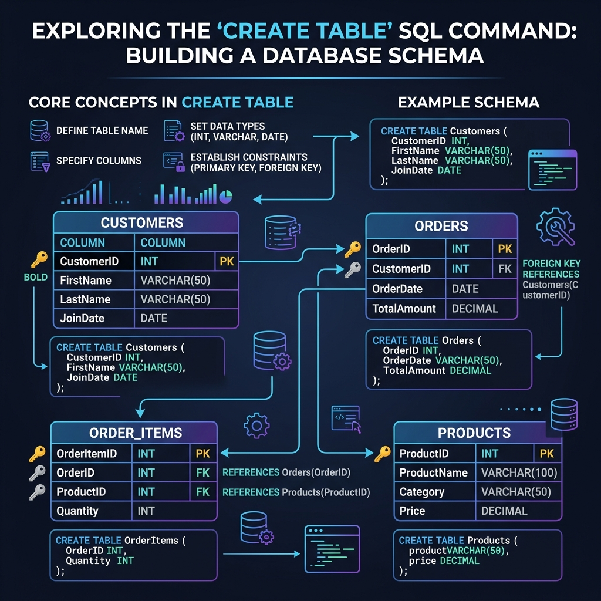

# သင်ခန်းစာ ၆ — Table (ဇယား) များ ဖန်တီးခြင်း (Creating Tables)



ဒေသင်ခန်းစာမာ မိမိကိုယ်တိုင် Table (ဇယား) များ ဖန်တီးတည်ဆောက်ပုံကို လေ့လာသွားပါဖို့။ Table တစ်ခုဆိုစွာ Excel Spreadsheet ပိုင် ကော်လံနန့် အတန်းများ ပါဝင်သော ဒေတာ သိမ်းဆည်းရာ နေရာဖြစ်ပါတယ်။

**ခန့်မှန်း ကြာချိန် - မိနစ် ၃၀**

---

## 🎨 Database ၏ ဖွဲ့စည်းပုံ visual Diagram (School Database Example)

```
┌─────────────────────────────────────────────────────────────────────────┐
│                      Database: "school" (ကျောင်းသုံး စနစ်)               │
│                                                                         │
│  ┌──────────────┐    ┌──────────────┐    ┌──────────────┐               │
│  │   students   │    │   teachers   │    │   courses    │               │
│  ├──────────────┤    ├──────────────┤    ├──────────────┤               │
│  │ 🆔 INT PK    │    │ 🆔 INT PK    │    │ 🆔 INT PK    │               │
│  │ name VARCHAR │    │ name VARCHAR │    │ name VARCHAR │               │
│  │ email UNIQUE │    │ subject      │    │ teacher_id FK│               │
│  └──────┬───────┘    └──────┬───────┘    └──────┬───────┘               │
│         │                   │                   │                       │
│         │ student_id (FK)   │                   │ course_id (FK)        │
│         ▼                   │                   ▼                       │
│  ┌──────────────────────────┴──────────────────────────┐                │
│  │                      enrollments                     │                │
│  ├──────────────────────────────────────────────────────┤                │
│  │ 🆔 INT PK                                            │                │
│  │ student_id (FK ➔ students.id)                        │                │
│  │ course_id  (FK ➔ courses.id)                         │                │
│  │ grade DECIMAL(5,2)                                   │                │
│  └──────────────────────────────────────────────────────┘                │
└─────────────────────────────────────────────────────────────────────────┘
```

---

## 🚀 အဆင့် ၁ - Database အသစ် ဖန်တီးခြင်း

အလျင်ဦးစွာ လေ့ကျင့်ရန် Database အသစ်တစ်ခု ဖန်တီးပါ -

```sql
CREATE DATABASE school;
USE school;
```

---

## 🛠️ အဆင့် ၂ - CREATE TABLE Command ၏ အခြေခံ သဘောတရား

```sql
CREATE TABLE table_name (
    column1_name data_type rules,
    column2_name data_type rules,
    column3_name data_type rules
);
```

```
   ┌──────────────┐         ┌───────────┐         ┌────────────────────────┐
   │ CREATE TABLE │ ──────► │ Table အမည် │ ──────► │ (Column1 Data_Type ... )│
   └──────────────┘         └───────────┘         └────────────────────────┘
```

---

## ⚡ အဆင့် ၃ - ပထမဆုံး Table ရေးသားတည်ဆောက်ခြင်း

`students` Table ကို ဖန်တီးကြပါစို့ -

```sql
CREATE TABLE students (
    id INT PRIMARY KEY AUTO_INCREMENT,
    first_name VARCHAR(50) NOT NULL,
    last_name VARCHAR(50) NOT NULL,
    email VARCHAR(100),
    age INT,
    enroll_date DATE
);
```

### 🔍 တစ်ခုချင်းစီ၏ ရှင်းလင်းချက် -

| အစိတ်ပိုင်း | ရှင်းလင်းချက် |
|---|---|
| `INT` | ကိန်းပြည့် ကိန်းဂဏန်း (1, 2, 3...) |
| `PRIMARY KEY` | အတန်းတိုင်းကို သီးသန့် ခွဲခြားပေးသည့် ပင်မသော့ (မထပ်ရပါ) |
| `AUTO_INCREMENT` | Data အသစ် ထည့်သည်နန့် နံပါတ် 1, 2, 3... Auto တိုးပေးသည် |
| `VARCHAR(50)` | စာသား ပမာဏ (အက္ခရာ ၅၀ အထိ) |
| `NOT NULL` | ဒေ Column ကို အလွတ်ထားလို့ မရပါ (မဖြစ်မနေ ဖြည့်ရမည်) |
| `DATE` | ရက်စွဲ သိမ်းဆည်းရန် (ဥပမာ '2025-01-15') |

---

## 📋 အဆင့် ၄ - Table ဖန်တီးပြီးကြောင်း စစ်ဆေးခြင်း

```sql
SHOW TABLES;
```

Table အဆောက်အအုံကို စစ်ဆေးရန် -

```sql
DESCRIBE students;
```

---

## 📊 အသုံးများသော Data Types များ visual Summary

```
  ┌───────────────────────────────────────────────────────────────────┐
  │                     MySQL Common Data Types                       │
  ├──────────────────┬────────────────────────────────────────────────┤
  │ INT              │ ကိန်းပြည့် ဂဏန်းများ (1, 42, 1000)               │
  │ DECIMAL(10,2)    │ ဒဿမ ဂဏန်းများ (ငွေပမာဏ 29.99, 100.00)         │
  │ VARCHAR(255)     │ စာသားများ (အက္ခရာ ၂၅၅ လုံးအထိ)                │
  │ TEXT             │ ဆောင်းပါးကဲ့သို့ စာသားရှည်များ                 │
  │ DATE             │ ရက်စွဲ (YYYY-MM-DD)                            │
  │ DATETIME         │ ရက်စွဲနန့် အချိန် (YYYY-MM-DD HH:MM:SS)          │
  │ BOOLEAN          │ မှန်/မှား (1 သို့မဟုတ် 0)                      │
  └──────────────────┴────────────────────────────────────────────────┘
```

---

## ⚙️ အဆင့် ၅ - Column စည်းမျဉ်းများ (Constraints)

```sql
CREATE TABLE products (
    id INT PRIMARY KEY AUTO_INCREMENT,
    name VARCHAR(100) NOT NULL,
    price DECIMAL(10, 2) NOT NULL,
    stock INT DEFAULT 0,
    is_active BOOLEAN DEFAULT TRUE,
    created_at TIMESTAMP DEFAULT CURRENT_TIMESTAMP
);
```

| စည်းမျဉ်း (Constraint) | ပြုလုပ်ပေးသော အရာ |
|---|---|
| `PRIMARY KEY` | ဒေတာ မထပ်အောင်နန့် သီးသန့် ခွဲခြားနိုင်အောင် ပြုလုပ်သည် |
| `NOT NULL` | တန်ဖိုး မဖြစ်မနေ ပါရမည် |
| `DEFAULT value` | တန်ဖိုး မထည့်ပါက သတ်မှတ်ထားသော တန်ဖိုးကို Auto ထည့်သည် |
| `UNIQUE` | အခြား အတန်းများနန့် တန်ဖိုး တူလို့ မရပါ |

---

## 🔗 အဆင့် ၆ - Table များစွာ ချိတ်ဆက်တည်ဆောက်ခြင်း (Foreign Key)

```sql
-- ၁။ ကျောင်းသား Table
CREATE TABLE students (
    id INT AUTO_INCREMENT PRIMARY KEY,
    first_name VARCHAR(50) NOT NULL,
    last_name VARCHAR(50) NOT NULL,
    email VARCHAR(100) UNIQUE,
    enrolled_at TIMESTAMP DEFAULT CURRENT_TIMESTAMP
);

-- ၂။ ဆရာ Table
CREATE TABLE teachers (
    id INT AUTO_INCREMENT PRIMARY KEY,
    first_name VARCHAR(50) NOT NULL,
    last_name VARCHAR(50) NOT NULL,
    subject VARCHAR(100)
);

-- ၃။ သင်တန်း Table (Teachers Table နန့် ချိတ်ဆက်ထားသည်)
CREATE TABLE courses (
    id INT AUTO_INCREMENT PRIMARY KEY,
    course_name VARCHAR(100) NOT NULL,
    teacher_id INT,
    FOREIGN KEY (teacher_id) REFERENCES teachers(id)
);

-- ၄။ ကျောင်းအပ်မှတ်တမ်း Table (Students နန့် Courses ကို ချိတ်ဆက်သည်)
CREATE TABLE enrollments (
    id INT AUTO_INCREMENT PRIMARY KEY,
    student_id INT NOT NULL,
    course_id INT NOT NULL,
    grade DECIMAL(5, 2),
    FOREIGN KEY (student_id) REFERENCES students(id),
    FOREIGN KEY (course_id) REFERENCES courses(id)
);
```

### Foreign Key ဆိုစွာ ဇာလဲ?

**Foreign Key** ဆိုစွာ Table နှစ်ခုကို ချိတ်ဆက်ပေးသော သော့ဖြစ်ပါတယ်။ ဥပမာ - `courses` Table မာဟိသော `teacher_id` စွာ `teachers` Table မာ တကယ်ဟိသော `id` နန့် ကိုက်ညီရပါမည်။ မဟိသော ဆရာ ID ကို ထည့်ပါက MySQL မှ လက်ခံမည် မဟုတ်ပါ။

---

## 🗑️ အဆင့် ၇ - Table ကို ပြန်လည် ဖျက်ပစ်ခြင်း

```sql
DROP TABLE table_name;
```

⚠️ **သတိပေးချက်:** Table ကို ဖျက်လိုက်ပါက ပါဝင်သော Data များပါ လုံးဝ ပျက်စီးသွားပါဖို့။ ပြန်ယူလို့ မရပါ!

---

## 📝 လေ့ကျင့်ခန်း (Exercise)

`library` အမည်ဖြင့် Database တစ်ခု ဖန်တီးပနာ အောက်ပါ Table (၃) ခု တည်ဆောက်ပါ -

၁. **books** — `id`, `title`, `author`, `isbn` (UNIQUE), `available` (BOOLEAN)
၂. **members** — `id`, `name`, `email` (UNIQUE), `phone`
၃. **borrowings** — `id`, `book_id` (FK), `member_id` (FK), `borrow_date`

---

## ➡️ နောက်ထပ် သွားရမည့် အဆင့်

Table များ တည်ဆောက်ပြီးပြီ ဖြစ်လို့ ယင်း Table များထဲသို့ Data အသစ်များ ထည့်သွင်းနည်း (INSERT) ကို လေ့လာကြပါစို့။

→ [သင်ခန်းစာ ၇: Data ထည့်သွင်းခြင်း (INSERT)](07-insert-data.md)
