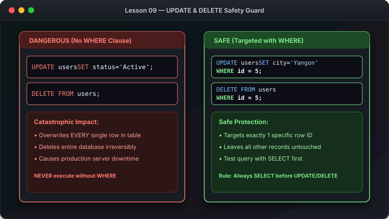

# သင်ခန်းစာ ၉ — Data ပြင်ဆင်ခြင်းနှင့် ဖျက်ပစ်ခြင်း (UPDATE & DELETE)



ဤသင်ခန်းစာမာ ရှိပြီးသား Data များကို ပြောင်းလဲ ပြင်ဆင်ခြင်း (UPDATE) နှင့် အတန်းများကို ဖျက်ပစ်ခြင်း (DELETE) တို့ကို လေ့လာသွားပါမည်။ **သတိပြုရန်:** ဤ Command များစွာ မူလ Data များကို အပြီးတိုင် ပြောင်းလဲသွားစေသည့်အတွက် အထူး သတိထားဆောင်ရွက်ရပါမည်။

**ခန့်မှန်း ကြာချိန် - မိနစ် ၂၀**

---

##  အရေးကြီးသော ဘေးကင်းရေး စည်းမျဉ်း (Safety Rule)

Data ပြင်ဆင်ခြင်း သို့မဟုတ် ဖျက်ပစ်ခြင်း မပြုမီ **အမြဲတမ်း** `SELECT` ဖြင့် မည်သည့် Data များ ပြောင်းလဲသွားမည်ကို အလျင် စစ်ဆေးပါ -

```

                      SAFE WORKFLOW DIAGRAM                              

                                                                         
  [ ၁။ SELECT ဖြင့် အလျင်စစ်ပါ ]  (ကြည့်ရှုစစ်ဆေးပါ - မှန်ကန်ပါသလား?)      
                                                                        
                                                                        
  [ ၂။ UPDATE / DELETE ကို ရေးပါ ]  (WHERE Clause ပါမပါ သေချာစစ်ပါ)    
                                                                        
                                                                        
  [ ၃။ SELECT ဖြင့် ပြန်လည် စစ်ဆေးပါ ]  (ပြောင်းလဲသွားပုံ ပြန်ကြည့်ပါ)   
                                                                         

```

```sql
-- အဆင့် ၁ - ပြောင်းလဲမည့် Data ကို အလျင် စစ်ဆေးပါ
SELECT * FROM customers WHERE city = 'Chicago';

-- အဆင့် ၂ - မှန်ကန်ပါကမှ ပြင်ဆင်မှုကို ပြုလုပ်ပါ
UPDATE customers SET city = 'New Chicago' WHERE city = 'Chicago';
```

---

##  UPDATE Command အသုံးပြုနည်း

### အခြေခံ ပုံစံ -

```sql
UPDATE table_name
SET column1 = new_value, column2 = new_value
WHERE condition;
```

```
 UPDATE with WHERE visual Diagram 
                                                                     
  WHERE id = 1 ဖြင့် သီးသန့် အတန်းကိုသာ သေနတ်ချိန်ပြီးလျှင် ပြင်ဆင်ခြင်း:  
                                                                     
  +----+---------+------------+------------------+                   
  | id | name    | city       | email            |                   
  +----+---------+------------+------------------+                   
  | 1  | U Ba    | Yangon     | uba@new.com      |  [ဤတန်းသာ ပြောင်းမည်]
  | 2  | Daw Hla | Mandalay   | hla@gmail.com    |                   
  | 3  | Ko Aung | Sittwe     | aung@gmail.com   |                   
  +----+---------+------------+------------------+                   
                                                                     
   WHERE မပါပါက Data အတန်း အားလုံး၏ email များ ပြောင်းသွားပါမည်!    

```

### ဥပမာ (၁) - Data တစ်ခုတည်းကို ပြောင်းခြင်း

```sql
UPDATE customers
SET email = 'john.new@email.com'
WHERE id = 1;
```

### ဥပမာ (၂) - Data အများအပြားကို တစ်ပြိုင်နက် ပြောင်းခြင်း

```sql
UPDATE customers
SET phone = '555-9999', city = 'Miami'
WHERE id = 3;
```

---

##  DELETE Command အသုံးပြုနည်း

### အခြေခံ ပုံစံ -

```sql
DELETE FROM table_name
WHERE condition;
```

```
 DELETE with WHERE visual Diagram 
                                                                     
  BEFORE (ယခင်):              AFTER (ဖျက်ပြီး):                       
  +----+---------+            +----+---------+                       
  | id | name    |            | id | name    |                       
  +----+---------+            +----+---------+                       
  | 8  | Dave    |            | 8  | Dave    |                       
  | 9  | Eva     |     | 9  | Eva     |                       
  | 10 | Frank   |  (Deleted)|              |  [id 10 ပျက်သွားသည်]
  | 11 | Grace   |            | 11 | Grace   |                       
  +----+---------+            +----+---------+                       

```

```sql
DELETE FROM customers
WHERE id = 10;
```

---

##  Data များကို ပျက်စီးစေတတ်သော ဘုံအမှားများ

| အမှားအယွင်း | ဖြစ်ပေါ်လာမည့် အကျိုးဆက် | ကာကွယ်နည်း |
|---|---|---|
| WHERE စာကြောင်း ရေးရန် မေ့သွားခြင်း | Table တစ်ခုလုံးဟိ Data များ ပျက်/ပြောင်းကုန်မည် | မပြေးမီ SELECT ဖြင့် အလျင် စမ်းသပ်ပါ |
| Condition စာလုံးပေါင်း မှားခြင်း | မဆိုင်သော Data များ ပျက်သွားမည် | `WHERE id = ...` ပင်မ သော့ကို သုံးပါ |

---

##  လေ့ကျင့်ခန်း (Exercise)

၁. Daw Hla ၏ မြို့ကို "Sittwe" သို့ ပြောင်းပါ - `UPDATE customers SET city = 'Sittwe' WHERE first_name = 'Daw';`
၂. Electronics ပစ္စည်းများ၏ စျေးနှုန်းကို ၅% တိုးပါ - `UPDATE products SET price = price * 1.05 WHERE category = 'Electronics';`
၃. စမ်းသပ် Data အသစ် ထည့်ပြီးလျှင် ပြန်ဖျက်ကြည့်ပါ -
   ```sql
   INSERT INTO customers (first_name, last_name, email) VALUES ('Test', 'User', 'test@email.com');
   DELETE FROM customers WHERE first_name = 'Test';
   ```

---

##  နောက်ထပ် သွားရမည့် အဆင့်

Data ပြင်ဆင်ဖျက်ပစ်နည်းကို လေ့လာပြီးပြီ ဖြစ်လို့ လိုအပ်သော Data များကို ပိုမို တိကျစွာ စစ်ထုတ်ရှာဖွေနည်း (Filtering & WHERE) ကို ဆက်လက် လေ့လာကြပါစို့။

-> [သင်ခန်းစာ ၁၀: Data စစ်ထုတ်ကြည့်ရှုခြင်း (WHERE & Filtering)](10-filtering.md)
