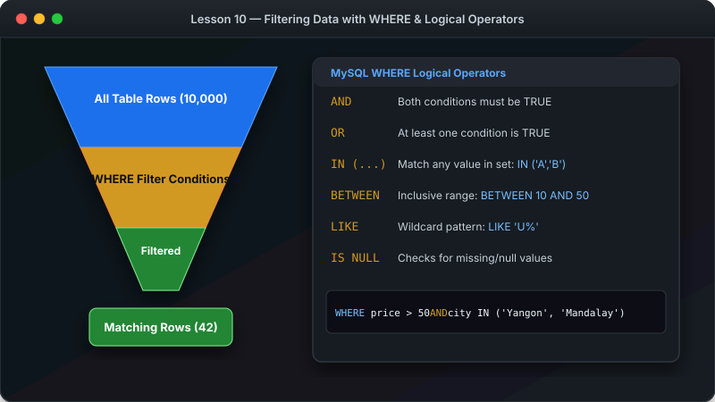

# သင်ခန်းစာ ၁၀ — Data စစ်ထုတ်ကြည့်ရှုခြင်း (WHERE & Filtering)



ဤသင်ခန်းစာမာ **WHERE** Clause ကို အသုံးပြုပြီးလျှင် လိုအပ်သော ဒေတာများကို သီးသန့် ရှာဖွေ စစ်ထုတ်နည်းကို လေ့လာသွားပါမည်။

**ခန့်မှန်း ကြာချိန် - မိနစ် ၂၅**

---

##  WHERE Clause Filter အလုပ်လုပ်ပုံ visual Diagram


---

##  WHERE Clause ၏ အခြေခံ ပုံစံ

```sql
SELECT * FROM table_name
WHERE condition;
```

---

##  အဆင့် ၁ - နှိုင်းယှဉ်ချက် သင်္ကေတများ (Comparison Operators)

| သင်္ကေတ | အဓိပ္ပာယ် | ဥပမာ |
|---|---|---|
| `=` | ညီမျှသည် | `WHERE price = 29.99` |
| `>` | ကြီးသည် | `WHERE price > 50` |
| `<` | ငယ်သည် | `WHERE age < 18` |
| `>=` | ကြီးသည် သို့ ညီသည် | `WHERE stock >= 10` |
| `<=` | ငယ်သည် သို့ ညီသည် | `WHERE price <= 20` |
| `!=` သို့ `<>` | မညီပါ | `WHERE status != 'cancelled'` |

---

##  အဆင့် ၂ - AND / OR ဖြင့် အခြေအနေများ ပေါင်းစပ်ခြင်း

### ဥပမာ (၁) - AND (နှစ်ခုလုံး မှန်ရမည်)
```sql
SELECT name, price FROM products 
WHERE price > 20 AND price < 60;
```

### ဥပမာ (၂) - OR (တစ်ခုမဟုတ် တစ်ခု မှန်လျှင် ရပြီ)
```sql
SELECT first_name, city FROM customers 
WHERE city = 'Yangon' OR city = 'Mandalay';
```

---

##  အဆင့် ၃ - BETWEEN ဖြင့် အတိုင်းအတာ သတ်မှတ်ခြင်း

```sql
-- စျေးနှုန်း ၂၀ နှင့် ၅၀ ကြားရှိသော ပစ္စည်းများ
SELECT name, price FROM products 
WHERE price BETWEEN 20 AND 50;
```

```sql
-- ၂၀၂၅ ဖေဖော်ဝါရီလအတွင်း ဖြစ်သော အော်ဒါများ
SELECT * FROM orders 
WHERE order_date BETWEEN '2025-02-01' AND '2025-02-28';
```

---

##  အဆင့် ၄ - IN ဖြင့် စာရင်းထဲမှ ရွေးချယ်ခြင်း

```sql
SELECT first_name, city FROM customers 
WHERE city IN ('Yangon', 'Mandalay', 'Sittwe');
```

---

##  အဆင့် ၅ - LIKE ဖြင့် စာသား ပုံစံ ရှာဖွေခြင်း (Wildcard Search)


```sql
-- Email စာလုံး "j" ဖြင့် စသော သူများ
SELECT first_name, email FROM customers WHERE email LIKE 'j%';

-- အမည်ထဲမာ "Pro" ပါသော ပစ္စည်းများ
SELECT name FROM products WHERE name LIKE '%Pro%';
```

---

##  လေ့ကျင့်ခန်း (Exercise)

၁. စျေးနှုန်း $30 ထက် သက်သာသော ပစ္စည်းများကို ရှာပါ။
၂. "Electronics" သို့မဟုတ် "Sports" အမျိုးအစား ပစ္စည်းများကို ရှာပါ။
၃. အမည်မာ "Pro" ဟု ပါဝင်သော ကုန်ပစ္စည်းများကို LIKE သုံးပြီးလျှင် ရှာပါ။

---

##  နောက်ထပ် သွားရမည့် အဆင့်

Data စစ်ထုတ်နည်းကို လေ့လာပြီးပြီ ဖြစ်လို့ ရရှိလာသော Data များကို အစဉ်လိုက် စီစဉ်ခြင်းနှင့် အရေအတွက် ကန့်သတ်ခြင်း (ORDER BY & LIMIT) ကို ဆက်လက် လေ့လာကြပါစို့။

-> [သင်ခန်းစာ ၁၁: Data စီခြင်းနှင့် အရေအတွက် ကန့်သတ်ခြင်း](11-sorting-limiting.md)
