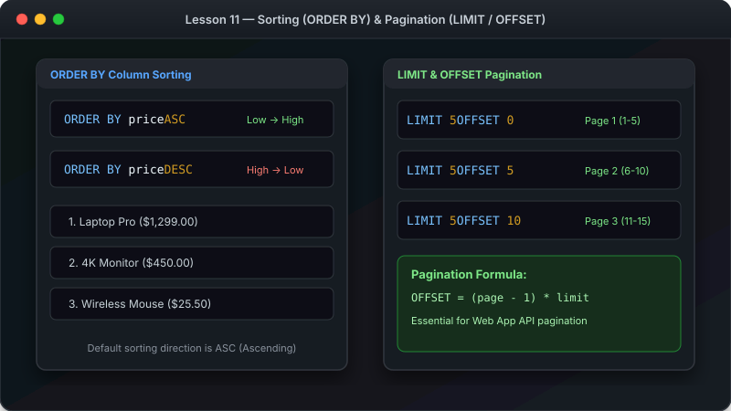

# သင်ခန်းစာ ၁၁ — Data စီခြင်းနှင့် အရေအတွက် ကန့်သတ်ခြင်း (ORDER BY & LIMIT)



ဤသင်ခန်းစာမာ ရရှိလာသော Data များကို အစဉ်လိုက် (အနည်းမှ အများ သို့ အများမှ အနည်း) စီစဉ်ခြင်း (ORDER BY) နှင့် ထွက်လာမည့် Data အရေအတွက်ကို ကန့်သတ်ကြည့်ရှုခြင်း (LIMIT & OFFSET) တို့ကို လေ့လာသွားပါမည်။

**ခန့်မှန်း ကြာချိန် - မိနစ် ၁၅**

---

##  ORDER BY စီစဉ်ပုံ visual Diagram


---

##  ORDER BY အသုံးပြုနည်း

### အခြေခံ ပုံစံ -

```sql
SELECT * FROM table_name
ORDER BY column_name ASC;   -- ASC = အနည်းမှ အများ (Default)
ORDER BY column_name DESC;  -- DESC = အများမှ အနည်း
```

### ဥပမာ (၁) - စျေးနှုန်း အသက်သာဆုံးမှ စတင်စီခြင်း
```sql
SELECT name, price FROM products ORDER BY price ASC;
```

### ဥပမာ (၂) - စျေးနှုန်း အကြီးဆုံးမှ စတင်စီခြင်း
```sql
SELECT name, price FROM products ORDER BY price DESC;
```

---

##  LIMIT — အရေအတွက် ကန့်သတ်ကြည့်ရှုခြင်း

```sql
SELECT name, price FROM products 
ORDER BY price DESC 
LIMIT 3;
```

စျေးနှုန်း အကြီးဆုံး ပစ္စည်း (၃) ခုကိုသာ သီးသန့် ထုတ်ပြပါမည်။

---

##  LIMIT & OFFSET — စာမျက်နှာ ခွဲကြည့်ခြင်း (Pagination)


```sql
-- အတန်း ၅ ခုကျော်ပြီးလျှင် နောက်ထပ် ၅ ခုကို ထုတ်ပြရန်
SELECT * FROM customers LIMIT 5 OFFSET 5;
```

---

##  WHERE, ORDER BY နှင့် LIMIT အစဉ်လိုက် ရေးသားပုံ

```sql
SELECT name, price FROM products 
WHERE price > 20
ORDER BY price DESC 
LIMIT 5;
```

1. **WHERE**: စျေးနှုန်း $20 ထက် ကြီးသူများကို စစ်ထုတ်သည်
2. **ORDER BY**: စျေးကြီးသူမှ စတင် စီစဉ်သည်
3. **LIMIT**: ထိပ်ဆုံး ၅ ခုကိုသာ ထုတ်ပြသည်

---

##  လေ့ကျင့်ခန်း (Exercise)

၁. အသက်သာဆုံး ပစ္စည်း (၃) ခုကို ရှာပါ - `ORDER BY price ASC LIMIT 3;`
၂. စျေးအကြီးဆုံး ပစ္စည်း (၅) ခုနှင့် ယင်းတို့၏ Category ကို ထုတ်ပြပါ။
၃. ဝယ်သူများကို အမည် (A-Z) အစဉ်လိုက် စီစဉ်ပြပါ။

---

##  နောက်ထပ် သွားရမည့် အဆင့်

ယခုအခါ Single Table ကို ကျွမ်းကျင်စွာ ကိုင်တွယ်နိုင်ပြီဖြစ်လို့ Table များကို ပေါင်းစပ်ပြီးလျှင် Data ထုတ်ယူနည်း (JOINs) ကို ဆက်လက် လေ့လာကြပါစို့။

-> [သင်ခန်းစာ ၁၂: Table များ ပေါင်းစပ်ကြည့်ရှုခြင်း (JOINs Made Simple)](12-joins.md)
