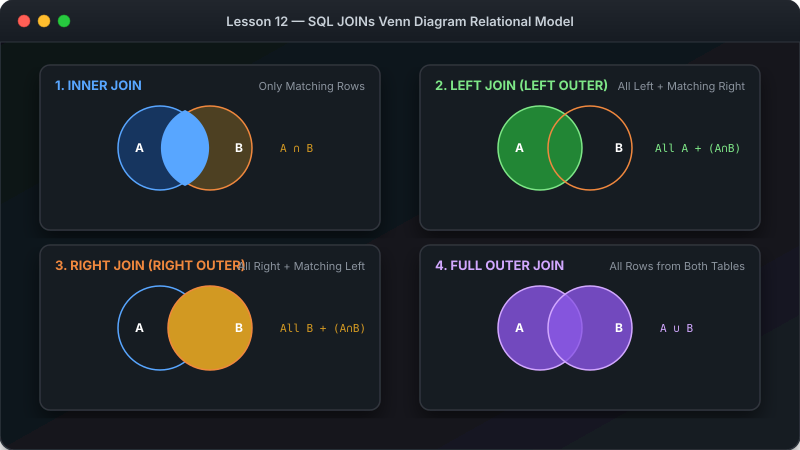

# သင်ခန်းစာ ၁၂ — Table များ ပေါင်းစပ်ကြည့်ရှုခြင်း (JOINs Made Simple)



**JOIN** ဆိုသည်မှာ Table နှစ်ခု သို့မဟုတ် နှစ်ခုထက်ပိုသော Table များကို ပေါင်းစပ်ပြီးလျှင် Data ထုတ်ယူသည့် စနစ်ဖြစ်ပါတယ်။ ယင်းသည် Database မာ အရေးအပါဆုံးနှင့် စွမ်းအားအထက်မြက်ဆုံး သဘောတရား ဖြစ်ပါတယ်။

**ခန့်မှန်း ကြာချိန် - မိနစ် ၃၅**

---

##  JOIN ပေါင်းစပ်ပုံ visual Diagram


---

##  ၁။ INNER JOIN (အသုံးအများဆုံး)

Table နှစ်ခုလုံးမာ ဒေတာ ကိုက်ညီမှု ရှိသော အတန်းများကိုသာ ထုတ်ပြပေးပါမည်။

```sql
SELECT orders.id AS order_id, 
       customers.first_name, 
       customers.last_name,
       orders.total_amount
FROM orders
INNER JOIN customers ON orders.customer_id = customers.id;
```

### Table Alias (အတိုကောက် အမည်ပေးခြင်း):

```sql
SELECT o.id, c.first_name, c.last_name, o.total_amount
FROM orders o
INNER JOIN customers c ON o.customer_id = c.id;
```

---

##  JOIN အမျိုးအစားများ visual Venn Diagram


---

##  ၂။ LEFT JOIN — လက်ဝဲဘက် Table ရှိ အရာအားလုံး ပါဝင်မည်

လက်ဝဲဘက် Table တွင်ရှိသော အချက်အလက်များ အားလုံး ပေါ်လာမည်ဖြစ်ပြီးလျှင် လက်ညာဘက် Table မာ မရှိပါက `NULL` ဟု ပြပါမည်။

```sql
-- အော်ဒါ ဝယ်ယူဖူးခြင်း မရှိသော ဝယ်သူများပါမကျန် အားလုံး ထုတ်ပြရန်
SELECT c.first_name, c.last_name, o.id AS order_id
FROM customers c
LEFT JOIN orders o ON c.id = o.customer_id;
```

### အော်ဒါ တစ်ခါမျှ မဝယ်ဖူးသော ဝယ်သူများကို သီးသန့် ရှာရန် -

```sql
SELECT c.first_name, c.last_name
FROM customers c
LEFT JOIN orders o ON c.id = o.customer_id
WHERE o.id IS NULL;
```

---

##  Table (၃) ခု ပေါင်းစပ်ခြင်း (Chain JOINs)

```sql
SELECT o.id AS order_id,
       c.first_name,
       p.name AS product_name,
       oi.quantity,
       oi.unit_price
FROM order_items oi
INNER JOIN orders o ON oi.order_id = o.id
INNER JOIN customers c ON o.customer_id = c.id
INNER JOIN products p ON oi.product_id = p.id;
```

---

##  လေ့ကျင့်ခန်း (Exercise)

၁. Orders နှင့် Customers ကို INNER JOIN ဖြင့် ပေါင်းပြီးလျှင် အော်ဒါ စာရင်း ထုတ်ပြပါ။
၂. တစ်ခါမျှ အော်ဒါ ဝယ်ယူခြင်း မဟိဖူးသော ဝယ်သူများကို ရှာပါ။ (LEFT JOIN + WHERE IS NULL)
၃. ဝယ်ယူထားသော ပစ္စည်း အမည်၊ ဝယ်သူ အမည်နှင့် စျေးနှုန်းများကို Table ၃ ခု JOIN ပြီးလျှင် ထုတ်ပြပါ။

---

##  နောက်ထပ် သွားရမည့် အဆင့်

Table များကို JOIN ပိုင် ပေါင်းစပ်တတ်သွားပြီဖြစ်လို့ ဒေတာများကို စုစည်း တွက်ချက်ခြင်း (Aggregations & GROUP BY) ကို ဆက်လက် လေ့လာကြပါစို့။

-> [သင်ခန်းစာ ၁၃: Data တွက်ချက် စုစည်းခြင်း (Aggregations & GROUP BY)](13-aggregations.md)
