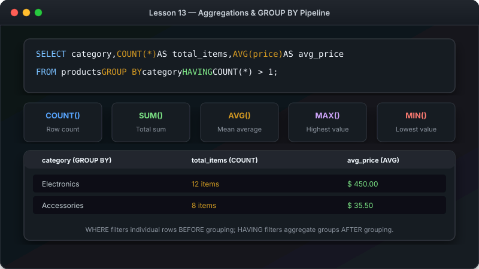

# သင်ခန်းစာ ၁၃ — Data တွက်ချက် စုစည်းခြင်း (Aggregations & GROUP BY)



**Aggregate Functions** နှင့် **GROUP BY** ကို အသုံးပြုပြီးလျှင် Data များကို ရေတွက်ခြင်း (Count)၊ ပေါင်းလဒ် ရှာခြင်း (Sum)၊ ပျမ်းမျှ တွက်ခြင်း (Average) နှင့် အုပ်စုဖွဲ့ခြင်းများ ပြုလုပ်နည်းကို လေ့လာသွားပါမည်။

**ခန့်မှန်း ကြာချိန် - မိနစ် ၂၅**

---

##  Aggregate Functions visual Summary

```

                      AGGREGATE FUNCTIONS ILLUSTRATION                   

  Data အတန်းများစွာ  အနှစ်ချုပ် တန်ဖိုးတစ်ခု ထွက်လာပုံ:                     
                                                                         
  +----------+--------------------+                                      
  | price    | product            |                                      
  +----------+--------------------+                                      
  | $999.99  | Laptop             |                                      
  | $29.99   | Mouse              |                                      
  | $199.99  | Keyboard           |                                      
  +----------+--------------------+                                      
                                                                         
  COUNT(*)    3 (အတန်း စုစုပေါင်း အရေအတွက်)                           
  SUM(price)  $1229.97 (စျေးနှုန်း အားလုံး ပေါင်းလဒ်)                       
  AVG(price)  $409.99 (ပျမ်းမျှ စျေးနှုန်း)                                
  MIN(price)  $29.99 (အသက်သာဆုံး စျေး)                                   
  MAX(price)  $999.99 (စျေးအကြီးဆုံး)                                      

```

---

##  တွက်ချက်သည့် Functions (၅) မျိုး

| Function | ပြုလုပ်ပေးသော အရာ | ဥပမာ |
|---|---|---|
| `COUNT()` | အတန်း အရေအတွက် ရေတွက်သည် | `COUNT(*)` |
| `SUM()` | တန်ဖိုးများကို ပေါင်းပေးသည် | `SUM(price)` |
| `AVG()` | ပျမ်းမျှ တန်ဖိုး တွက်သည် | `AVG(price)` |
| `MIN()` | အငယ်ဆုံး တန်ဖိုးကို ရှာသည် | `MIN(price)` |
| `MAX()` | အကြီးဆုံး တန်ဖိုးကို ရှာသည် | `MAX(price)` |

---

##  GROUP BY — အုပ်စုဖွဲ့ပြီးလျှင် တွက်ချက်ခြင်း

Data များကို အမျိုးအစားအလိုက် အုပ်စုဖွဲ့ပြီးလျှင် တွက်ချက်လိုသည့်အခါ `GROUP BY` ကို သုံးပါတယ် -

```sql
SELECT category, COUNT(*) AS product_count 
FROM products 
GROUP BY category;
```

```
 GROUP BY Bucket Method visual 
                                                                 
  Products Data  Category အလိုက် အံဆွဲများထဲ ခွဲထည့်လိုက်ပုံ:     
                                                                 
   Electronics Bucket: (Laptop, Mouse, Keyboard)  Count: 3   
   Clothing Bucket:    (T-Shirt, Jeans)            Count: 2   
   Footwear Bucket:    (Sneakers)                  Count: 1   

```

---

##  WHERE နှင့် HAVING ခြားနားချက် visual Diagram

```

                           WHERE vs HAVING                               

                                                                         
  [ ၁။ FROM ]       Table မှ Data များ ယူသည်                           
                                                                        
                                                                        
  [ ၂။ WHERE ]      အတန်း တခုချင်းစီကို အလျင် စစ်ထုတ်သည် (Group မဖွဲ့မီ)   
                                                                        
                                                                        
  [ ၃။ GROUP BY ]   အုပ်စု ဖွဲ့သည်                                       
                                                                        
                                                                        
  [ ၄။ HAVING ]     တွက်ချက်ပြီး ရလဒ် အုပ်စုများကို စစ်ထုတ်သည် (Group ဖွဲ့ပြီး)
                                                                         

```

```sql
-- Product အရေအတွက် ၂ ခုထက် ပိုသော Category များကိုသာ ရှာရန်
SELECT category, COUNT(*) AS count
FROM products
GROUP BY category
HAVING COUNT(*) > 2;
```

---

##  လေ့ကျင့်ခန်း (Exercise)

၁. အော်ဒါ စုစုပေါင်း အရေအတွက်ကို ရေတွက်ပါ - `SELECT COUNT(*) FROM orders;`
၂. ပျမ်းမျှ အော်ဒါ စျေးနှုန်းကို တွက်ပါ - `SELECT AVG(total_amount) FROM orders;`
၃. ဝယ်သူ တစ်ယောက်စီ၏ ဝယ်ယူမှု စုစုပေါင်း ပမာဏကို `SUM` နှင့် `GROUP BY` သုံးပြီးလျှင် ထုတ်ပြပါ။

---

##  နောက်ထပ် သွားရမည့် အဆင့်

ဂုဏ်ယူပါတယ်။ သင်ခန်းစာ ၁၃ ခုလုံး တတ်မြောက်သွားပြီဖြစ်လို့ အဆုံးသတ် သင်ခန်းစာဖြစ်သော Database ကို Backup သိမ်းဆည်းခြင်းနှင့် ပြန် Restore လုပ်နည်းကို လေ့လာကြပါစို့။

-> [သင်ခန်းစာ ၁၄: Backup ယူခြင်းနှင့် ပြန် Restore လုပ်ခြင်း](14-backup-restore.md)
