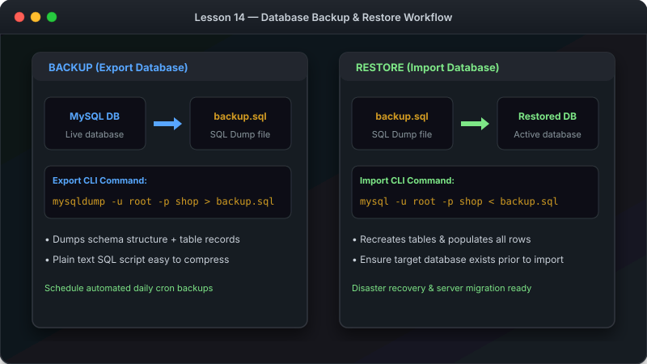

# သင်ခန်းစာ ၁၄ — Backup ယူခြင်းနှင့် ပြန် Restore လုပ်ခြင်း (Backup and Restore)



ဤသင်ခန်းစာမာ မိမိ၏ Database များကို ဘေးကင်းစွာ Backup သိမ်းဆည်းနည်းနှင့် ပျက်စီးသွားပါက ပြန်လည် ယူငင်နည်း (Restore) တို့ကို လေ့လာသွားပါမည်။ ဤနည်းလမ်းစွာ ဒေတာ ပျက်စီးမှုမှ ကာကွယ်ရန် အရေးကြီးဆုံး လုပ်ဆောင်ချက် ဖြစ်ပါတယ်။

**ခန့်မှန်း ကြာချိန် - မိနစ် ၂၀**

---

##  Backup & Restore စက်ဝန်း visual Diagram

```

                      BACKUP & RESTORE WORKFLOW                          

                                                                         
                    
     MySQL Database                             shop-backup.sql      
     (Live Server Data)                         (Backup SQL File)    
                    
                                                                       
                  mysqldump -u root -p shop > ...                      
                              
                  (1. BACKUP / EXPORT)                                 
                                                                       
                  mysql -u root -p shop < ...                          
                              
                  (2. RESTORE / IMPORT)                                 
                                                                         

```

---

##  နည်းလမ်း (၁): `mysqldump` ဖြင့် Backup ယူနည်း (Command Line)

`mysqldump` စွာ Database တစ်ခုလုံးကို ပြန်လည် တည်ဆောက်နိုင်သော SQL Command ဖိုင် (`.sql`) အဖြစ် သိမ်းဆည်းပေးပါသည်။

### Database တစ်ခုတည်းကို Backup ယူရန် -

```bash
mysqldump -u root -p shop > shop-backup.sql
```

### Database အားလုံးကို တစ်ပြိုင်နက် Backup ယူရန် -

```bash
mysqldump -u root -p --all-databases > all-databases-backup.sql
```

---

##  Backup ဖိုင်မှ ပြန်လည် ထည့်သွင်းခြင်း (Restore)

### Command Line မှ ပြန်လည် ထည့်သွင်းနည်း -

```bash
mysql -u root -p shop < shop-backup.sql
```

### Database အသစ်တစ်ခု ထဲသို့ ပြန်လည် ထည့်သွင်းနည်း -

```bash
# ၁။ Database အလွတ် တစ်ခု အလျင် ဖန်တီးပါ
mysql -u root -p -e "CREATE DATABASE shop_restore;"

# ၂။ ယင်း Database အသစ် ထဲသို့ Restore လုပ်ပါ
mysql -u root -p shop_restore < shop-backup.sql
```

---

##  နည်းလမ်း (၂): Workbench GUI ဖြင့် Export / Import လုပ်နည်း

### Export (Backup ယူနည်း) -

၁. Schema Panel မှ Database ပေါ် Right-click ထိပြီးလျှင် **"Export Wizard"** ကို ရွေးပါ။
၂. အဆင့်များကို လိုက်နာပြီးလျှင် **"Start Export"** ကို နှိပ်ပါ။

### Import (Restore ပြန်လုပ်နည်း) -

၁. Right-click  **"Import Wizard"** ကို ရွေးပါ။
၂. `.sql` Backup ဖိုင်ကို ရွေးချယ်ပြီးလျှင် **"Start Import"** ကို နှိပ်ပါ။

---

##  လေ့ကျင့်ခန်း (Exercise)

၁. Command Line မှတစ်ဆင့် `shop` Database ကို Backup ယူကြည့်ပါ - `mysqldump -u root -p shop > shop-backup.sql`
၂. `shop` Database ကို ဖျက်ပစ်ပါ - `DROP DATABASE shop;`
၃. Backup ဖိုင်မှတစ်ဆင့် `shop` Database ကို ပြန် Restore လုပ်ပါ - `mysql -u root -p shop < shop-backup.sql`

---

##  ဂုဏ်ယူပါတယ်! (Course Completed!)

သင်စွာ MySQL အခြေခံ သင်ခန်းစာ (၁၄) ခုလုံးကို အောင်မြင်စွာ လေ့လာ ပြီးဆုံးခဲ့ပြီ ဖြစ်ပါတယ်။

```

                      CONGRATULATIONS! COURSE COMPLETED!                 

                                                                         
  သင် တတ်မြောက်သွားသော အသိပညာများ:                                      
   MySQL Server & Workbench တပ်ဆင်/အသုံးပြုနည်း                        
   Command Line ဖြင့် Database မိုင်တိုင်စိုက် ကိုင်တွယ်နည်း                     
   Database & Table များ ဖန်တီးတည်ဆောက်နည်း                             
   Data များ အသစ်ထည့်၊ ဖတ်ယူ၊ ပြင်ဆင်၊ ဖျက်ပစ်နည်း (CRUD)                 
   WHERE, ORDER BY, LIMIT ဖြင့် စစ်ထုတ် စီစဉ်နည်း                       
   JOINs ဖြင့် Table များ ပေါင်းစပ်နည်း                                
   GROUP BY နှင့် Aggregations ဖြင့် အနှစ်ချုပ် တွက်ချက်နည်း                
   Database Backup & Restore စနစ်တကျ ပြုလုပ်နည်း                        
                                                                         

```

ကျေးဇူးတင်ပါသည်! 
