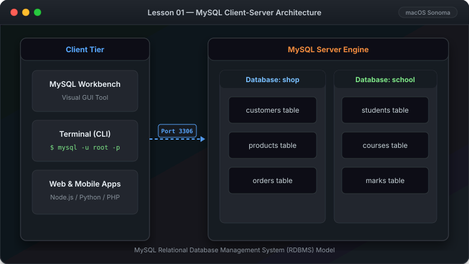

# MySQL အခြေခံ သင်ခန်းစာများ (MySQL Beginner Course)

မြန်မာဘာသာဖြင့် အစမှစ၍ လွယ်လွယ်ကူကူ လေ့လာနိုင်ရန် ပြုစုထားသော MySQL အခြေခံ Database သင်ခန်းစာနှင့် mdBook စာအုပ်။



---

##  GitHub Pages တွင် စာအုပ်အဖြစ် ဖတ်ရှုရန် (Online Book)

ဤ Repository ကို GitHub Pages ဖြင့် အလိုအလျောက် Online Book အဖြစ် Deploy လုပ်ထားပါသည်။

 **[Online Book ဖတ်ရန် နှိပ်ပါ (GitHub Pages Live Book)](https://KyawTunLinn.github.io/mysql-basic/)**

---

##  GitHub Repo တွင် အလွယ်တကူ Deploy ပြုလုပ်နည်း (Deployment Guide)

ဤ Repository တွင် **GitHub Actions (`.github/workflows/deploy.yml`)** ပါဝင်ပြီး ဖြစ်သဖြင့် သင်၏ GitHub Repo တွင် Deploy ပြုလုပ်ရန် အောက်ပါအတိုင်း 1-Step သာ ဆောင်ရွက်ရန် လိုအပ်ပါသည်:

1. **GitHub Repository Settings** သို့ သွားပါ (`Settings` -> `Pages`)
2. **Build and deployment** အောက်ရှိ **Source** တွင် **`GitHub Actions`** ကို ရွေးချယ်ပေးပါ (Branch ကို ရွေးရန် မလိုပါ)။
3. `main` branch သို့ Code Push ပြုလုပ်ပါက GitHub Actions မှ `mdBook` ကို အလိုအလျောက် Build လုပ်၍ GitHub Pages ပေါ်သို့ Deploy တင်ပေးသွားမည် ဖြစ်ပါသည်။

---

##  မိမိ Computer တွင် Local Preview ကြည့်ရှုနည်း

```bash
# 1. mdBook ကို Install လုပ်ပါ (Rust / Cargo သို့မဟုတ် Binary)
cargo install mdbook

# 2. Local Server ဖြင့် စာအုပ်ဖွင့်ကြည့်ပါ
mdbook serve --open
```

---

##  SVG Vector Graphics

သင်ခန်းစာတိုင်းတွင် **High-Resolution Scalable Vector Graphics (SVG)** ကို သုံးစွဲထားသဖြင့် Screen အမျိုးအစားမရွေး (Dark Mode / Light Mode / Mobile / Desktop) တွင် ကြည်လင်ပြတ်သားစွာ ရှုမြင်နိုင်ပါသည်။

-  `images/lesson01.svg` — MySQL Architecture & Overview
-  `images/lesson02.svg` — Installation Workflow
-  `images/lesson03.svg` — MySQL Workbench GUI
-  `images/lesson04.svg` — Command Line Client (CLI)
-  `images/lesson05.svg` — First SQL Queries
-  `images/lesson06.svg` — CREATE TABLE & Data Types
-  `images/lesson07.svg` — INSERT INTO Data Flow
-  `images/lesson08.svg` — SELECT Data Queries
-  `images/lesson09.svg` — UPDATE & DELETE Safety Guard
-  `images/lesson10.svg` — WHERE Filtering Funnel
-  `images/lesson11.svg` — ORDER BY & LIMIT Pagination
-  `images/lesson12.svg` — SQL JOINs Venn Diagrams
-  `images/lesson13.svg` — Aggregate Functions & GROUP BY
-  `images/lesson14.svg` — Backup & Restore Workflow

---

##  သင်ခန်းစာများ မာတိကာ (Table of Contents)

1. [သင်ခန်းစာ ၁ — MySQL အကြောင်း မိတ်ဆက်](01-introduction.md)
2. [သင်ခန်းစာ ၂ — MySQL Server တပ်ဆင်နည်း](02-installation.md)
3. [သင်ခန်းစာ ၃ — MySQL Workbench အသုံးပြုနည်း Guide](03-workbench.md)
4. [သင်ခန်းစာ ၄ — Command Line (Terminal) အခြေခံ အသုံးပြုနည်း](04-command-line.md)
5. [သင်ခန်းစာ ၅ — ပထမဆုံး SQL Query များ ရေးသားခြင်း](05-first-queries.md)
6. [သင်ခန်းစာ ၆ — Table (ဇယား) များ ဖန်တီးခြင်း](06-create-tables.md)
7. [သင်ခန်းစာ ၇ — Data (အချက်အလက်) ထည့်သွင်းခြင်း (INSERT)](07-insert-data.md)
8. [သင်ခန်းစာ ၈ — Data များ ဖတ်ယူခြင်း (SELECT)](08-select-data.md)
9. [သင်ခန်းစာ ၉ — Data ပြင်ဆင်ခြင်းနှင့် ဖျက်ပစ်ခြင်း (UPDATE & DELETE)](09-update-delete.md)
10. [သင်ခန်းစာ ၁၀ — Data စစ်ထုတ်ကြည့်ရှုခြင်း (FILTERING & WHERE)](10-filtering.md)
11. [သင်ခန်းစာ ၁၁ — Data စီစဉ်ခြင်းနှင့် အရေအတွက် ကန့်သတ်ခြင်း (ORDER BY & LIMIT)](11-sorting-limiting.md)
12. [သင်ခန်းစာ ၁၂ — Table များ ပေါင်းစပ်ကြည့်ရှုခြင်း (JOINs Made Simple)](12-joins.md)
13. [သင်ခန်းစာ ၁၃ — Data တွက်ချက် စုစည်းခြင်း (Aggregations & GROUP BY)](13-aggregations.md)
14. [သင်ခန်းစာ ၁၄ — Database Backup ယူခြင်းနှင့် ပြန်လည် ထည့်သွင်းခြင်း (Restore)](14-backup-restore.md)

---

-  [MySQL Quick Cheat Sheet (မြန်မာဘာသာ အတိုကောက် မှတ်စု)](mysql-cheat-sheet.md)
-  [Sample Database (စမ်းသပ်ရန် ဒေတာဘေ့စ်)](sample-database.md)