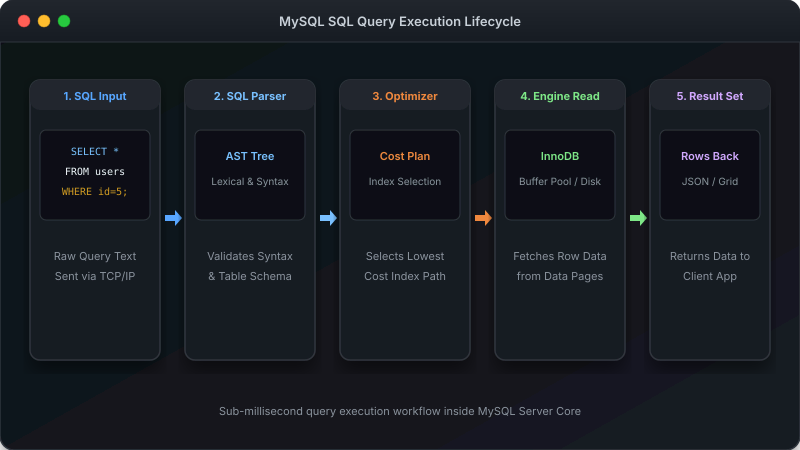

# MySQL Quick Reference Cheat Sheet (ရခိုင်ဘာသာ အတိုကောက် မှတ်စု)

လေ့ကျင့်စဉ်မာ အလွယ်တကူ ကိုးကား ကြည့်ရှုနိုင်သော MySQL အသုံးများ အတိုကောက် မှတ်စု ဖြစ်ပါတယ်။

---

##  SQL Query စနစ် ပိုက်လိုင်း အပြည့်အစုံ (Execution Order)



---

##  MySQL သို့ ချိတ်ဆက်ခြင်း

```bash
# Command line မှ ချိတ်ဆက်ရန်
mysql -u root -p

# သီးသန့် Database သို့ တိုက်ရိုက် ဝင်ရန်
mysql -u root -p shop

# Command တစ်ခုတည်း Run ပြီးလျှင် ပြန်ထွက်ရန်
mysql -u root -p -e "SHOW DATABASES;"

# MySQL မှ ပြန်ထွက်ရန်
EXIT;
# သို့မဟုတ်
QUIT;
```

---

##  Database ဆိုင်ရာ Command များ

```sql
-- Database အားလုံး ကြည့်ရန်
SHOW DATABASES;

-- Database အသစ် ဖန်တီးရန်
CREATE DATABASE my_database;

-- Database ရွေးချယ် အသုံးပြုရန်
USE shop;

-- Database ကို ဖျက်ပစ်ရန်
DROP DATABASE my_database;
```

---

##  Table ဆိုင်ရာ Command များ

```sql
-- Table စာရင်း ကြည့်ရန်
SHOW TABLES;

-- Table အဆောက်အအုံ စစ်ဆေးရန်
DESCRIBE table_name;
-- သို့မဟုတ်:
DESC table_name;

-- Table ဖန်တီးရန်
CREATE TABLE students (
    id INT AUTO_INCREMENT PRIMARY KEY,
    name VARCHAR(100) NOT NULL,
    email VARCHAR(100) UNIQUE,
    age INT
);

-- Table ဖျက်ပစ်ရန်
DROP TABLE table_name;

-- Table အမည် ပြောင်းရန်
RENAME TABLE old_name TO new_name;

-- Column အသစ် ထပ်တိုးရန်
ALTER TABLE students ADD phone VARCHAR(20);

-- Column ဖျက်ပစ်ရန်
ALTER TABLE students DROP COLUMN phone;
```

---

##  INSERT — Data ထည့်သွင်းခြင်း

```sql
-- Data တန်း တစ်ခု ထည့်ရန်
INSERT INTO customers (first_name, last_name, email)
VALUES ('U', 'Ba', 'uba@gmail.com');

-- Data တန်း များစွာ တစ်ပြိုင်နက် ထည့်ရန်
INSERT INTO products (name, price, category) VALUES
('Laptop', 999.99, 'Electronics'),
('Mouse', 29.99, 'Electronics'),
('Desk', 199.99, 'Furniture');
```

---

##  SELECT — Data ဖတ်ယူခြင်း

```sql
-- Column အားလုံး ကြည့်ရန်
SELECT * FROM customers;

-- သီးသန့် Column များကိုသာ ကြည့်ရန်
SELECT first_name, email FROM customers;

-- Alias အမည်သစ် ဖြင့် ကြည့်ရန်
SELECT first_name AS name, email AS contact FROM customers;

-- မထပ်သော Data များကိုသာ ထုတ်ကြည့်ရန်
SELECT DISTINCT city FROM customers;

-- အရေအတွက် ရေတွက်ရန်
SELECT COUNT(*) FROM customers;

-- တွက်ချက်မှု ပြုလုပ်ရန်
SELECT name, price, price * 1.1 AS price_with_tax FROM products;

-- စာသားများ ပေါင်းစပ်ရန်
SELECT CONCAT(first_name, ' ', last_name) AS full_name FROM customers;
```

---

##  WHERE — Data စစ်ထုတ်ခြင်း

```sql
-- ညီမျှမှု စစ်ရန်
SELECT * FROM products WHERE price = 29.99;

-- ကြီး / ငယ် စစ်ရန်
SELECT * FROM products WHERE price > 50;
SELECT * FROM products WHERE price <= 30;

-- ကြားဟိ တန်ဖိုး စစ်ရန်
SELECT * FROM products WHERE price BETWEEN 20 AND 60;

-- စာရင်းထဲမှ ရွေးရန်
SELECT * FROM customers WHERE city IN ('Yangon', 'Mandalay', 'Sittwe');

-- စာသား ပုံစံ ရှာရန် (LIKE)
SELECT * FROM customers WHERE email LIKE 'j%';      -- j ဖြင့် စသူများ
SELECT * FROM products WHERE name LIKE '%Pro%';      -- Pro ပါသူများ
SELECT * FROM customers WHERE city LIKE '%as';       -- as ဖြင့် ဆုံးသူများ

-- AND / OR ပေါင်းစပ်ရန်
SELECT * FROM products WHERE price > 20 AND category = 'Electronics';
SELECT * FROM products WHERE category = 'Books' OR category = 'Sports';

-- NULL စစ်ရန်
SELECT * FROM customers WHERE phone IS NULL;
SELECT * FROM customers WHERE phone IS NOT NULL;
```

---

##  ORDER BY နှင့် LIMIT

```sql
-- အနည်းမှ အများ စီရန် (ASC)
SELECT * FROM products ORDER BY price ASC;

-- အများမှ အနည်း စီရန် (DESC)
SELECT * FROM products ORDER BY price DESC;

-- အရေအတွက် ကန့်သတ်ရန်
SELECT * FROM products ORDER BY price DESC LIMIT 5;

-- စာမျက်နှာ ခွဲကြည့်ရန် (Pagination)
SELECT * FROM products LIMIT 10 OFFSET 20;
```

---

##  UPDATE — Data ပြင်ဆင်ခြင်း

```sql
-- Data ပြောင်းလဲရန်
UPDATE customers SET email = 'new@email.com' WHERE id = 1;

-- Column အများအပြား ပြောင်းရန်
UPDATE customers SET phone = '555-0000', city = 'Sittwe' WHERE id = 1;

--  WHERE အမြဲ သုံးပါ! မဟုတ်ပါက အတန်း အားလုံး ပြောင်းသွားပါမည်!
```

---

##  DELETE — Data ဖျက်ပစ်ခြင်း

```sql
-- သီးသန့် အတန်း ဖျက်ရန်
DELETE FROM customers WHERE id = 1;

--  WHERE အမြဲ သုံးပါ! မဟုတ်ပါက အတန်း အားလုံး ပျက်သွားပါမည်!
```

---

##  JOINs — Table များ ပေါင်းစပ်ခြင်း

```sql
-- INNER JOIN (ကိုက်ညီသူများသာ)
SELECT o.id, c.first_name
FROM orders o
INNER JOIN customers c ON o.customer_id = c.id;

-- LEFT JOIN (လက်ဝဲဘက် အားလုံး)
SELECT c.first_name, o.id
FROM customers c
LEFT JOIN orders o ON c.id = o.customer_id;
```

---

##  Aggregations — တွက်ချက်ခြင်း

```sql
-- COUNT, SUM, AVG, MIN, MAX
SELECT COUNT(*), SUM(total_amount), AVG(total_amount) FROM orders;

-- GROUP BY & HAVING
SELECT category, COUNT(*) AS count
FROM products
GROUP BY category
HAVING COUNT(*) > 2;
```

---

##  Backup နှင့် Restore

```bash
# Backup ယူရန်
mysqldump -u root -p shop > shop-backup.sql

# Restore ပြန်လုပ်ရန်
mysql -u root -p shop < shop-backup.sql
```

---

##  Shortcuts များ

| Action | Workbench | Command Line |
|---|---|---|
| Run query | `Ctrl + Enter` | Enter (Semicolon `;` ပြီးမှ) |
| Save file | `Ctrl + S` | — |
| Autocomplete | `Ctrl + Space` | `Tab` |
| Previous command | — | `^` Up Arrow |
